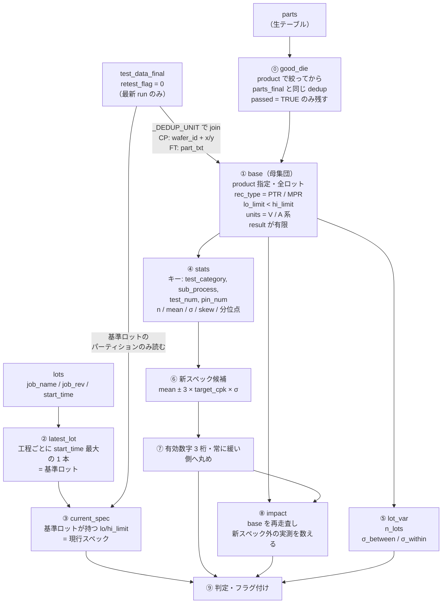
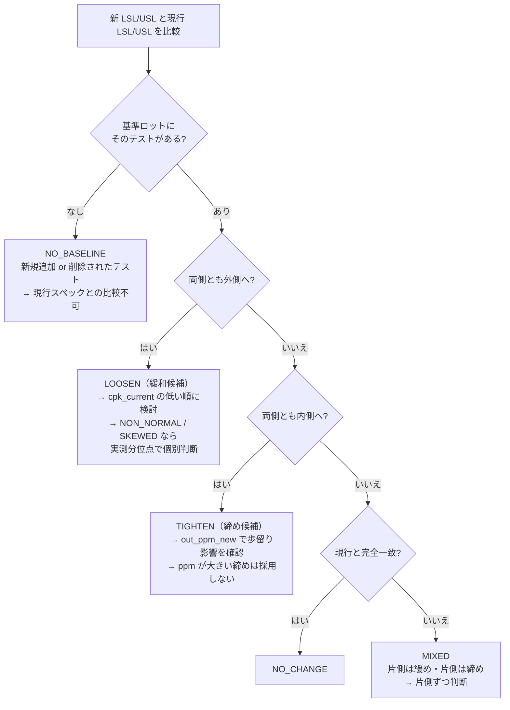

# サンプル SQL クエリ集

`schema.md` で定義された 5 テーブル（`lots` / `wafers` / `parts` / `test_data` /
`chipid`）を DuckDB ビュー経由で検索する際のリファレンスです。

> [!IMPORTANT]
> **歩留り・解析は原則 `*_final` ビューを使ってください。**
> 生テーブル（`parts` / `test_data`）はリテストの**全試行**を含むため、そのまま
> 集計すると二重計上になります。`parts_final` / `test_data_final` /
> `chipid_final` は「ダイ/パッケージごとに最新リテストのみ」へ重複排除済みです。
> `wafers` の `part_count` / `good_count` は WRR の報告値（リテストは部分母集団・
> FT には存在しない）なので、**歩留りは `parts_final` から算出**します。
>
> **`test_data_final` の行セマンティクスに注意**: 重複排除は ingest 時点で
> 付与される `retest_flag`（`storage.py`）によるもので、`test_data_final` は
> `WHERE retest_flag = 0` の単純フィルタです（`parts_final` / `chipid_final` は
> 従来どおり `ROW_NUMBER()` ウィンドウ）。そのため、旧実装と異なり **(die, test,
> pin) につき複数行が残ることがあります**（例: OTP ダンプの 1 test_num に対する
> 512 個のループ計測）。反復回を区別するには `exec_seq`（run 内 0 始まり出現順）
> を使い、1 テストにつき 1 値が欲しい場合は `exec_seq` で絞るか集約してください。

## 実行方法

### VS Code で対話的に実行（推奨）

プロジェクトルートの **`query.py`** を VS Code で開き、各セル (`# %%`) を Shift+Enter で実行します。
[Python 拡張](https://marketplace.visualstudio.com/items?itemName=ms-python.python) + Jupyter サポートが必要です。
`query.py` は gitignore された個人スクラッチです — 初回やリポジトリ更新後は
`cp query.py.example query.py` でテンプレートから最新化してください。

```
# セットアップセルを実行後、LOT_ID を書き換えて各セルを実行
LOT_ID = "E6A773.00"
```

> [!TIP]
> **`test_data_final` はもう遅くありません**：ingest 時に付与される `retest_flag`
> による単純フィルタなので、`test_name LIKE` などロット絞り込みクエリも通常の
> Parquet スキャンと同じ速さです（`test_data_final` を毎クエリ `ROW_NUMBER()` で
> 再計算していた旧実装では、ロット単位の `test_name` 検索が実データで 12 分以上
> かかっていました）。
>
> **`parts_final` / `chipid_final` は引き続き `ROW_NUMBER()` ウィンドウ**です
> （小テーブルなのでコストは無視できる範囲）。同じロットへ繰り返しクエリする
> 場合は `use_lot('LOT_ID')` を呼ぶと、そのロットの `parts_final` /
> `test_data_final` / `chipid_final` をメモリ上の表に materialize し、クエリ
> ごとの Parquet 再スキャン（特にネットワーク共有上のストアで重い）を回避
> できます。全ロットに戻すには `use_all()`。
> 全件を Python に取り込む場合は `q(sql, limit=0, as_arrow=True)`（pandas 変換を
> 省いて約 3.5 倍）か、ファイル出力なら `to_csv(sql)` を使ってください。

### CLI から直接実行

```bash
# DuckDB シェル（対話モード）
stdf db shell

# 1 クエリを実行して表示
stdf db query "SELECT lot_id, product FROM lots ORDER BY start_time DESC LIMIT 10"
```

### Python スクリプトから（`*_final` ビューの定義込み）

`stdf db` / `query.py` は `*_final` を自動定義しますが、素の DuckDB から使う場合は
以下のように生ビューと派生ビューを作成します。

```python
import duckdb
con = duckdb.connect(":memory:")

for t in ["lots", "wafers", "parts", "test_data", "chipid"]:
    # test_data alone can mix pre-flag files (no exec_seq/retest_flag columns)
    # with new ones; union_by_name fills the missing columns with NULL instead
    # of erroring on schema mismatch.
    extra = ", union_by_name=true" if t == "test_data" else ""
    con.execute(f"""
        CREATE OR REPLACE VIEW {t} AS
        SELECT * FROM read_parquet('data/{t}/**/*.parquet', hive_partitioning=true{extra})
    """)

# dedup identity: CP=ダイ座標 / FT=パッケージ 2D バーコード
DEDUP = ("CASE WHEN test_category = 'FT' THEN part_txt "
         "ELSE CONCAT(wafer_id, '|', x_coord, '|', y_coord) END")

con.execute(f"""
    CREATE OR REPLACE VIEW parts_final AS
    SELECT * EXCLUDE (rn) FROM (
        SELECT *, ROW_NUMBER() OVER (
            PARTITION BY lot_id, {DEDUP} ORDER BY retest_num DESC) AS rn
        FROM parts) WHERE rn = 1
""")
# test_data_final is NOT a window: dedup happens at ingest time (storage.py
# writes retest_flag per row), so this is a plain predicate filter — cheap,
# and pushed into the Parquet scan. Rows with retest_flag IS NULL (pre-flag
# files) are excluded; that store needs a re-ingest (see stdf db verify-flags).
con.execute("""
    CREATE OR REPLACE VIEW test_data_final AS
    SELECT * FROM test_data WHERE retest_flag = 0
""")
con.execute("""
    CREATE OR REPLACE VIEW chipid_final AS
    SELECT * EXCLUDE (rn) FROM (
        SELECT *, ROW_NUMBER() OVER (
            PARTITION BY lot_id, efuse_raw ORDER BY retest_num DESC) AS rn
        FROM chipid) WHERE rn = 1
""")
```

---

> [!TIP]
> パーティション列（`product`, `test_category`, `sub_process`, `lot_id`,
> `wafer_id`, `retest`）で絞ると高速です。

---

## 1. テストプログラム Check Out

### 1-1. テストプログラム名・リビジョン一覧

```sql
SELECT DISTINCT product, sub_process, job_name, job_rev
FROM lots
ORDER BY product, sub_process, job_name, job_rev;
```

### 1-2. 特定プログラムの最新リビジョンを確認

```sql
SELECT product, sub_process, job_name, job_rev,
       MAX(start_time) AS last_used
FROM lots
GROUP BY product, sub_process, job_name, job_rev
ORDER BY last_used DESC;
```

### 1-3. 特定ロットのテストプログラム情報

```sql
SELECT lot_id, product, sub_process, job_name, job_rev,
       tester_type, operator, start_time, finish_time
FROM lots
WHERE lot_id = 'YOUR_LOT_ID';
```

### 1-4. 特定ロットのテストプログラムと全データ一括取得

ロット → ダイ（最新リテスト）→ 測定値を 1 クエリで取得します。`parts_final` /
`test_data_final` を使うのでリテストは最新のみ。

```sql
SELECT
    l.lot_id, l.product, l.sub_process, l.job_name, l.job_rev,
    l.tester_type, l.operator,
    -- ダイ情報（最新リテスト）
    p.part_id, p.wafer_id, p.part_txt,
    p.x_coord, p.y_coord, p.hard_bin, p.soft_bin,
    p.passed AS die_passed, p.retest_num,
    -- テスト測定値（最新リテスト）
    td.test_num, td.test_name, td.rec_type,
    td.result, td.lo_limit, td.hi_limit, td.units,
    td.passed AS test_passed
FROM lots l
JOIN parts_final p      ON l.lot_id = p.lot_id
JOIN test_data_final td ON p.lot_id = td.lot_id AND p.part_id = td.part_id
WHERE l.lot_id = 'YOUR_LOT_ID'
ORDER BY p.wafer_id, p.part_id, td.test_num;
```

> [!TIP]
> 行数が多い場合は `COPY (...) TO 'output.csv' (HEADER)` で CSV 出力するか、
> `WHERE p.wafer_id = '...'` を追加して絞ると扱いやすくなります。

---

## 2. ロット検索

### 2-1. 製品 × 工程でロット一覧

```sql
SELECT lot_id, product, sub_process, start_time, finish_time, job_name, job_rev
FROM lots
WHERE product = 'YOUR_PRODUCT' AND sub_process = 'CP1'
ORDER BY start_time DESC;
```

### 2-2. 期間指定でロット検索

```sql
SELECT *
FROM lots
WHERE start_time >= TIMESTAMP '2025-01-01'
  AND start_time <  TIMESTAMP '2025-02-01'
ORDER BY start_time;
```

### 2-3. ロット歩留りサマリ（CP / FT 両対応・retest 反映）

`parts_final` から算出するので、CP も FT も同じクエリで正しい最終歩留りが出ます。

```sql
SELECT
    l.lot_id, l.product, l.test_category, l.sub_process, l.job_name,
    COUNT(*)                                              AS dies,
    SUM(CASE WHEN p.passed THEN 1 ELSE 0 END)             AS good,
    ROUND(100.0 * SUM(CASE WHEN p.passed THEN 1 ELSE 0 END)
          / NULLIF(COUNT(*), 0), 2)                       AS yield_pct
FROM lots l
JOIN parts_final p ON l.lot_id = p.lot_id
GROUP BY l.lot_id, l.product, l.test_category, l.sub_process, l.job_name
ORDER BY l.product, l.test_category, yield_pct;
```

---

## 3. ウェーハ / 歩留り（CP）

### 3-1. ロット内ウェーハ別歩留り（retest 反映 / parts_final 由来）

```sql
SELECT
    wafer_id,
    COUNT(*)                                             AS dies,
    SUM(CASE WHEN passed THEN 1 ELSE 0 END)              AS good,
    ROUND(100.0 * SUM(CASE WHEN passed THEN 1 ELSE 0 END)
          / NULLIF(COUNT(*), 0), 2)                      AS yield_pct
FROM parts_final
WHERE lot_id = 'YOUR_LOT_ID'
GROUP BY wafer_id
ORDER BY yield_pct;
```

### 3-2. 歩留り低下ウェーハの抽出（90% 未満）

```sql
SELECT wafer_id, COUNT(*) AS dies,
       SUM(CASE WHEN passed THEN 1 ELSE 0 END) AS good,
       ROUND(100.0 * SUM(CASE WHEN passed THEN 1 ELSE 0 END)
             / NULLIF(COUNT(*), 0), 2) AS yield_pct
FROM parts_final
WHERE lot_id = 'YOUR_LOT_ID'
GROUP BY wafer_id
HAVING ROUND(100.0 * SUM(CASE WHEN passed THEN 1 ELSE 0 END)
             / NULLIF(COUNT(*), 0), 2) < 90
ORDER BY yield_pct;
```

### 3-3. WRR 報告値 vs 実測（parts）歩留りの突合

`wafers`（WRR）と `parts_final` の歩留りが食い違う＝リテストや欠損の兆候。

```sql
SELECT
    w.wafer_id,
    w.good_count                                  AS wrr_good,
    w.part_count                                  AS wrr_total,
    p.good                                        AS parts_good,
    p.dies                                        AS parts_total,
    ROUND(100.0 * w.good_count / NULLIF(w.part_count, 0), 2) AS wrr_yield,
    ROUND(100.0 * p.good / NULLIF(p.dies, 0), 2)            AS parts_yield
FROM (
    SELECT *, ROW_NUMBER() OVER (
        PARTITION BY lot_id, wafer_id ORDER BY retest_num DESC) AS rn
    FROM wafers WHERE lot_id = 'YOUR_LOT_ID'
) w
JOIN (
    SELECT wafer_id, COUNT(*) AS dies,
           SUM(CASE WHEN passed THEN 1 ELSE 0 END) AS good
    FROM parts_final WHERE lot_id = 'YOUR_LOT_ID'
    GROUP BY wafer_id
) p ON w.wafer_id = p.wafer_id
WHERE w.rn = 1
ORDER BY ABS(wrr_yield - parts_yield) DESC;
```

### 3-4. ウェーハマップ（die 座標 × bin）

ヒートマップ／ウェーハマップ描画用の素データ。

```sql
SELECT x_coord, y_coord, hard_bin, soft_bin, passed
FROM parts_final
WHERE lot_id = 'YOUR_LOT_ID' AND wafer_id = 'YOUR_WAFER_ID'
ORDER BY y_coord, x_coord;
```

### 3-5. ウェーハ中心 vs エッジの歩留り（ゾーン分析）

エッジ不良の傾向を見る。半径はウェーハ座標系に合わせて調整。

```sql
WITH d AS (
    SELECT *,
           SQRT(POWER(x_coord, 2) + POWER(y_coord, 2)) AS r
    FROM parts_final
    WHERE lot_id = 'YOUR_LOT_ID' AND wafer_id = 'YOUR_WAFER_ID'
)
SELECT
    CASE WHEN r <= 50 THEN '1_center'
         WHEN r <= 90 THEN '2_middle'
         ELSE '3_edge' END                          AS zone,
    COUNT(*)                                         AS dies,
    SUM(CASE WHEN passed THEN 1 ELSE 0 END)          AS good,
    ROUND(100.0 * SUM(CASE WHEN passed THEN 1 ELSE 0 END)
          / NULLIF(COUNT(*), 0), 2)                  AS yield_pct
FROM d
GROUP BY zone
ORDER BY zone;
```

---

## 4. ダイ / ビン分析

### 4-1. ウェーハ内の Fail ダイ一覧

```sql
SELECT part_id, x_coord, y_coord, hard_bin, soft_bin, test_count, test_time
FROM parts_final
WHERE lot_id = 'YOUR_LOT_ID' AND wafer_id = 'YOUR_WAFER_ID' AND passed = FALSE
ORDER BY hard_bin, soft_bin;
```

### 4-2. ビン分布（ウェーハ単位）

```sql
SELECT hard_bin, soft_bin,
       COUNT(*)                                          AS die_count,
       ROUND(COUNT(*) * 100.0 / SUM(COUNT(*)) OVER (), 2) AS pct
FROM parts_final
WHERE lot_id = 'YOUR_LOT_ID' AND wafer_id = 'YOUR_WAFER_ID'
GROUP BY hard_bin, soft_bin
ORDER BY hard_bin, soft_bin;
```

### 4-3. ソフトビン・パレート（累積 % 付き）

不良ビンの寄与度を上位から。歩留り改善の優先順位付けに。

```sql
SELECT
    soft_bin,
    COUNT(*)                                                  AS die_count,
    ROUND(100.0 * COUNT(*) / SUM(COUNT(*)) OVER (), 2)        AS pct,
    ROUND(100.0 * SUM(COUNT(*)) OVER (ORDER BY COUNT(*) DESC)
          / SUM(COUNT(*)) OVER (), 2)                         AS cumulative_pct
FROM parts_final
WHERE lot_id = 'YOUR_LOT_ID' AND passed = FALSE
GROUP BY soft_bin
ORDER BY die_count DESC;
```

### 4-4. 隣接 Fail のクラスタ検出（同一座標近傍の連続不良）

Fail die の上下左右いずれかに別の Fail がある＝クラスタ不良の候補。

```sql
WITH f AS (
    SELECT x_coord, y_coord
    FROM parts_final
    WHERE lot_id = 'YOUR_LOT_ID' AND wafer_id = 'YOUR_WAFER_ID'
      AND passed = FALSE
)
SELECT a.x_coord, a.y_coord,
       COUNT(b.x_coord) AS fail_neighbors
FROM f a
JOIN f b
  ON ABS(a.x_coord - b.x_coord) + ABS(a.y_coord - b.y_coord) = 1
GROUP BY a.x_coord, a.y_coord
ORDER BY fail_neighbors DESC, a.y_coord, a.x_coord;
```

---

## 5. パラメトリック測定（test_data）

> [!NOTE]
> `test_data_final` は最新 run の全行を保持します。ループ計測（例: 1 test_num
> の下に複数回書かれる OTP ワード）がある場合、同じ `(die, test_num, pin_num)`
> に複数行が残ります。反復回を区別したいときは `exec_seq`（run 内 0 始まり
> 出現順。OTP ワードインデックス等に対応）で `WHERE` するか、以下のサマリ系
> クエリのように `GROUP BY` / 集約関数で丸めてください。

### 5-1. 特定テスト項目の統計サマリ

```sql
SELECT
    test_num, test_name, units, lo_limit, hi_limit,
    COUNT(*)                  AS cnt,
    ROUND(AVG(result), 4)     AS avg_val,
    ROUND(STDDEV(result), 4)  AS stddev_val,
    ROUND(MIN(result), 4)     AS min_val,
    ROUND(MAX(result), 4)     AS max_val,
    ROUND(MEDIAN(result), 4)  AS median_val,
    ROUND(QUANTILE_CONT(result, 0.25), 4) AS q1,
    ROUND(QUANTILE_CONT(result, 0.75), 4) AS q3
FROM test_data_final
WHERE lot_id = 'YOUR_LOT_ID' AND test_name = 'YOUR_TEST_NAME'
GROUP BY test_num, test_name, units, lo_limit, hi_limit;
```

### 5-2. 規格外（Fail）テストの抽出

```sql
SELECT part_id, x_coord, y_coord, test_num, test_name,
       result, lo_limit, hi_limit, units
FROM test_data_final
WHERE lot_id = 'YOUR_LOT_ID' AND wafer_id = 'YOUR_WAFER_ID' AND passed = 'F'
ORDER BY test_num, part_id;
```

### 5-3. テスト項目ごとの Fail 率ワーストランキング

```sql
SELECT
    test_num, test_name,
    COUNT(*)                                       AS total,
    SUM(CASE WHEN passed = 'F' THEN 1 ELSE 0 END)  AS fail_cnt,
    ROUND(SUM(CASE WHEN passed = 'F' THEN 1 ELSE 0 END)
          * 100.0 / COUNT(*), 2)                   AS fail_pct
FROM test_data_final
WHERE lot_id = 'YOUR_LOT_ID'
GROUP BY test_num, test_name
HAVING SUM(CASE WHEN passed = 'F' THEN 1 ELSE 0 END) > 0
ORDER BY fail_pct DESC;
```

### 5-4. 特定ダイの全テスト結果

```sql
SELECT test_num, test_name, rec_type, result, lo_limit, hi_limit, units, passed
FROM test_data_final
WHERE lot_id = 'YOUR_LOT_ID' AND part_id = 'YOUR_PART_ID'
ORDER BY test_num;
```

### 5-5. 規格マージン（限界に近いテスト＝歩留りリスク）

測定値が規格幅のどれだけ内側にあるか。`margin_pct` が小さいほど危険。

```sql
SELECT
    test_num, test_name, units, lo_limit, hi_limit,
    ROUND(AVG(result), 4)  AS mean,
    ROUND(100.0 * LEAST(AVG(result) - lo_limit, hi_limit - AVG(result))
          / NULLIF(hi_limit - lo_limit, 0), 2) AS margin_pct
FROM test_data_final
WHERE lot_id = 'YOUR_LOT_ID'
  AND lo_limit IS NOT NULL AND hi_limit IS NOT NULL
  AND rec_type IN ('PTR', 'MPR')
GROUP BY test_num, test_name, units, lo_limit, hi_limit
HAVING COUNT(*) > 1
ORDER BY margin_pct;
```

### 5-6. 外れ値検出（平均 ± 3σ を超えるダイ）

```sql
WITH stat AS (
    SELECT test_num, AVG(result) AS mu, STDDEV(result) AS sigma
    FROM test_data_final
    WHERE lot_id = 'YOUR_LOT_ID' AND test_name = 'YOUR_TEST_NAME'
    GROUP BY test_num
)
SELECT t.part_id, t.x_coord, t.y_coord, t.result,
       ROUND((t.result - s.mu) / NULLIF(s.sigma, 0), 2) AS z_score
FROM test_data_final t
JOIN stat s ON t.test_num = s.test_num
WHERE t.lot_id = 'YOUR_LOT_ID' AND t.test_name = 'YOUR_TEST_NAME'
  AND ABS(t.result - s.mu) > 3 * s.sigma
ORDER BY ABS(t.result - s.mu) DESC;
```

### 5-7. サイト間ばらつき（site-to-site）

`site_num`（parts 側）別にテスト平均を比較。テスター間差・ハンドラ差の検出。

```sql
SELECT
    p.site_num,
    td.test_name,
    COUNT(*)                 AS n,
    ROUND(AVG(td.result), 4) AS mean,
    ROUND(STDDEV(td.result), 4) AS sigma
FROM test_data_final td
JOIN parts_final p ON td.lot_id = p.lot_id AND td.part_id = p.part_id
WHERE td.lot_id = 'YOUR_LOT_ID' AND td.test_name = 'YOUR_TEST_NAME'
GROUP BY p.site_num, td.test_name
ORDER BY p.site_num;
```

### 5-8. 2 テスト項目間の相関

```sql
WITH pivoted AS (
    SELECT part_id,
           MAX(CASE WHEN test_name = 'TEST_A' THEN result END) AS a,
           MAX(CASE WHEN test_name = 'TEST_B' THEN result END) AS b
    FROM test_data_final
    WHERE lot_id = 'YOUR_LOT_ID' AND test_name IN ('TEST_A', 'TEST_B')
    GROUP BY part_id
)
SELECT
    COUNT(*)                       AS n,
    ROUND(CORR(a, b), 4)           AS pearson_r,
    ROUND(REGR_SLOPE(b, a), 6)     AS slope,
    ROUND(REGR_INTERCEPT(b, a), 6) AS intercept
FROM pivoted
WHERE a IS NOT NULL AND b IS NOT NULL;
```

### 5-9. MPR ピン別の分布（マルチピン測定）

```sql
SELECT pin_num, pin_name, units,
       COUNT(*)                 AS n,
       ROUND(AVG(result), 4)    AS mean,
       ROUND(STDDEV(result), 4) AS sigma
FROM test_data_final
WHERE lot_id = 'YOUR_LOT_ID' AND rec_type = 'MPR'
  AND test_name = 'YOUR_TEST_NAME'
GROUP BY pin_num, pin_name, units
ORDER BY pin_num;
```

---

## 6. リテスト分析

### 6-1. リテスト回数の分布（最終 retest_num 別ダイ数）

```sql
SELECT retest_num, COUNT(*) AS dies
FROM parts_final
WHERE lot_id = 'YOUR_LOT_ID'
GROUP BY retest_num
ORDER BY retest_num;
```

### 6-2. リテストによる歩留り改善量（初回 vs 最終）

`retest_num = 0`（初回）と最終（parts_final）の合否を比較。

```sql
WITH first AS (
    SELECT lot_id, wafer_id, x_coord, y_coord, part_txt, passed AS passed0
    FROM parts
    WHERE lot_id = 'YOUR_LOT_ID' AND retest_num = 0
),
final AS (
    SELECT lot_id, wafer_id, x_coord, y_coord, part_txt, passed AS passed_final
    FROM parts_final
    WHERE lot_id = 'YOUR_LOT_ID'
)
SELECT
    COUNT(*)                                                   AS dies,
    SUM(CASE WHEN passed0 THEN 1 ELSE 0 END)                   AS good_run0,
    SUM(CASE WHEN passed_final THEN 1 ELSE 0 END)              AS good_final,
    SUM(CASE WHEN NOT passed0 AND passed_final THEN 1 ELSE 0 END) AS recovered_by_retest
FROM first f
JOIN final fn USING (lot_id, wafer_id, x_coord, y_coord, part_txt);
```

> [!NOTE]
> FT は `wafer_id` / 座標が空のため、結合キーは実質 `part_txt` で効きます。
> CP は `wafer_id` + 座標で die を一意化します。

### 6-3. リテストでも Fail のままのダイ（恒久不良）

```sql
SELECT wafer_id, part_txt, x_coord, y_coord, hard_bin, soft_bin, retest_num
FROM parts_final
WHERE lot_id = 'YOUR_LOT_ID' AND passed = FALSE AND retest_num > 0
ORDER BY wafer_id, y_coord, x_coord;
```

---

## 7. クロステーブル / 工程横断

### 7-1. ロット歩留りトレンド（日次・parts_final 由来）

```sql
SELECT
    DATE_TRUNC('day', l.start_time) AS test_date,
    l.product, l.sub_process,
    COUNT(DISTINCT l.lot_id)        AS lot_count,
    COUNT(*)                        AS dies,
    SUM(CASE WHEN p.passed THEN 1 ELSE 0 END) AS good,
    ROUND(100.0 * SUM(CASE WHEN p.passed THEN 1 ELSE 0 END)
          / NULLIF(COUNT(*), 0), 2) AS yield_pct
FROM lots l
JOIN parts_final p ON l.lot_id = p.lot_id
WHERE l.product = 'YOUR_PRODUCT'
GROUP BY test_date, l.product, l.sub_process
ORDER BY test_date;
```

### 7-2. テスター × オペレータ別の歩留り比較

```sql
SELECT
    l.tester_type, l.operator,
    COUNT(DISTINCT l.lot_id) AS lot_count,
    COUNT(*)                 AS dies,
    SUM(CASE WHEN p.passed THEN 1 ELSE 0 END) AS good,
    ROUND(100.0 * SUM(CASE WHEN p.passed THEN 1 ELSE 0 END)
          / NULLIF(COUNT(*), 0), 2) AS yield_pct
FROM lots l
JOIN parts_final p ON l.lot_id = p.lot_id
GROUP BY l.tester_type, l.operator
ORDER BY yield_pct;
```

### 7-3. Fail ビンとテスト項目の紐付け

```sql
SELECT
    p.hard_bin, p.soft_bin, td.test_num, td.test_name,
    COUNT(*) AS fail_count
FROM parts_final p
JOIN test_data_final td ON p.lot_id = td.lot_id AND p.part_id = td.part_id
WHERE p.lot_id = 'YOUR_LOT_ID' AND p.passed = FALSE AND td.passed = 'F'
GROUP BY p.hard_bin, p.soft_bin, td.test_num, td.test_name
ORDER BY fail_count DESC;
```

### 7-4. 複数ロットの歩留り比較

```sql
SELECT
    l.lot_id, l.job_rev,
    COUNT(*)                 AS dies,
    SUM(CASE WHEN p.passed THEN 1 ELSE 0 END) AS good,
    ROUND(100.0 * SUM(CASE WHEN p.passed THEN 1 ELSE 0 END)
          / NULLIF(COUNT(*), 0), 2) AS yield_pct
FROM lots l
JOIN parts_final p ON l.lot_id = p.lot_id
WHERE l.lot_id IN ('LOT_A', 'LOT_B', 'LOT_C')
GROUP BY l.lot_id, l.job_rev
ORDER BY yield_pct DESC;
```

---

## 8. Cp / Cpk 算出（工程能力）

### 8-1. ロット単位の Cp / Cpk（現行スペックに対する簡易版）

```sql
SELECT
    test_num, test_name, units, lo_limit, hi_limit,
    COUNT(*)                  AS n,
    ROUND(AVG(result), 6)     AS mean,
    ROUND(STDDEV(result), 6)  AS sigma,
    -- Cp = (USL - LSL) / (6σ)
    ROUND((hi_limit - lo_limit) / (6 * STDDEV(result)), 3) AS cp,
    -- Cpk = min((USL - μ)/3σ, (μ - LSL)/3σ)
    ROUND(LEAST(
        (hi_limit - AVG(result)) / (3 * STDDEV(result)),
        (AVG(result) - lo_limit) / (3 * STDDEV(result))
    ), 3) AS cpk
FROM test_data_final
WHERE lot_id = 'YOUR_LOT_ID'
  AND lo_limit IS NOT NULL AND hi_limit IS NOT NULL
  AND rec_type IN ('PTR', 'MPR')
GROUP BY test_num, test_name, units, lo_limit, hi_limit
HAVING COUNT(*) > 1
ORDER BY cpk;
```

> Cpk < 1.33 はマージン不足の目安。`5-5`（規格マージン）と併せて確認します。

### 8-2. 次期プログラム向けスペック検討（緩和 / 締めの判断材料）

現行データから、次期テストプログラムのリミット候補を `mean ± 3 × Cpk_target × σ`
で算出し、**緩和・締めの両方向**を提案するクエリです。8-1 との違い:

| | 8-1 | 8-2 |
|---|---|---|
| 母集団 | 1 ロット・全ダイ | 全ロット・**良品ダイのみ**（`parts.passed`）|
| 現行スペック | 行が持つリミットで `GROUP BY` | **基準ロット**（工程ごとに `start_time` 最大）のリミット |
| 出力 | Cp / Cpk | 新リミット候補 + 逸脱 ppm + 診断フラグ |

**このクエリが答える 2 つの問い**

- *「そのスペックは最新か」* — リミットは STDF の PTR/MPR にロット（＝ファイル）
  ごとに記録されています。基準ロットのリミットを「現行」とし、全ロットを通して
  リミットが変わっているかを `limits_changed` / `LIMIT_CHANGED` で示します。
- *「どのテストプログラムか」* — `lots.job_name` / `job_rev` を join し、基準ロット
  の版を `latest_job_name` / `latest_job_rev` に出します。

**データの流れと絞り込み条件**（丸数字は SQL 中の CTE コメントに対応）



**判定フロー**



```sql
WITH params AS (
    SELECT 'YOUR_PRODUCT'         AS product,
           CAST(1.33 AS DOUBLE)   AS target_cpk,
           30                     AS min_n,             -- これ未満は LOW_SAMPLE
           -- 除外ロット。例 CAST('2620%' AS VARCHAR) / 不要なら NULL のまま
           CAST(NULL AS VARCHAR)  AS exclude_lot_pattern
),

-- ⓪ 良品ダイ: parts_final と同一セマンティクスの dedup を product 指定の内側で行う
--    （parts_final をそのまま join すると全製品を読む。理由は後述「性能上の注意」）
good_die AS (
    SELECT lot_id, wafer_id, x_coord, y_coord, part_txt
    FROM (
        SELECT p.lot_id, p.wafer_id, p.x_coord, p.y_coord, p.part_txt, p.passed,
               ROW_NUMBER() OVER (
                   PARTITION BY p.lot_id, p.wafer_id, p.x_coord, p.y_coord,
                       CASE WHEN p.x_coord = -32768 AND p.y_coord = -32768
                            THEN p.part_txt ELSE '' END
                   ORDER BY p.retest_num DESC) AS rn
        FROM parts p CROSS JOIN params pa
        WHERE p.product = pa.product
    ) WHERE rn = 1 AND passed
),

-- ① 母集団: 最新 run（test_data_final）× 良品ダイ（⓪ good_die）
--    join キーは views.py の _DEDUP_UNIT と同一（CP=ウェーハ+座標 / FT=part_txt）
--    pin_num は PTR で NULL のため -1 に畳む（NULL は join で一致しないため）
base AS (
    SELECT
        td.product, td.test_category, td.sub_process, td.lot_id,
        td.test_num, td.test_name, td.units,
        COALESCE(td.pin_num, -1) AS pin_num,
        COALESCE(td.pin_name, '') AS pin_name,
        td.lo_limit, td.hi_limit, td.result, td.exec_seq
    FROM test_data_final td
    JOIN good_die p
      ON  p.lot_id   = td.lot_id
      AND p.wafer_id = td.wafer_id
      AND p.x_coord  = td.x_coord
      AND p.y_coord  = td.y_coord
      AND (CASE WHEN td.x_coord = -32768 AND td.y_coord = -32768
                THEN td.part_txt ELSE '' END)
        = (CASE WHEN p.x_coord  = -32768 AND p.y_coord  = -32768
                THEN p.part_txt  ELSE '' END)
    CROSS JOIN params pa
    WHERE td.product = pa.product
      AND td.rec_type IN ('PTR', 'MPR')
      AND (pa.exclude_lot_pattern IS NULL
           OR td.lot_id NOT LIKE pa.exclude_lot_pattern)
      AND td.result IS NOT NULL   AND isfinite(td.result)
      AND td.lo_limit IS NOT NULL AND isfinite(td.lo_limit)
      AND td.hi_limit IS NOT NULL AND isfinite(td.hi_limit)
      AND td.lo_limit < td.hi_limit   -- リミット無しテストの (0,0) もここで落ちる
      -- 単位は V / A 系のみ（V, MV, UV, NA, PA … 接頭辞 1 文字まで許容）。
      -- 全テストを対象にするならこの 1 行を削除
      AND regexp_matches(UPPER(TRIM(td.units)), '^.?[VA]$')
),

-- ② 基準ロット: 工程（test_category × sub_process）ごとに start_time 最大の 1 本
latest_lot AS (
    SELECT product, test_category, sub_process, lot_id, job_name, job_rev
    FROM (
        SELECT l.*, ROW_NUMBER() OVER (
                   PARTITION BY l.product, l.test_category, l.sub_process
                   -- lot_id はタイブレーク。start_time が同値のロットがあると
                   -- 基準ロットが実行ごとに変わり、現行スペックが揺れるため
                   ORDER BY l.start_time DESC, l.lot_id DESC) AS rn
        FROM lots l CROSS JOIN params pa
        WHERE l.product = pa.product
          AND (pa.exclude_lot_pattern IS NULL
               OR l.lot_id NOT LIKE pa.exclude_lot_pattern)
    ) WHERE rn = 1
),

-- ③ 現行スペック = 基準ロットが持っていたリミット
--    base ではなく test_data_final から直接引く。リミットはダイに依存しないので
--    良品フィルタが不要で、lot_id はパーティション列なので基準ロットの
--    ファイルだけを読めば済む（base の再走査を 1 回減らせる）
current_spec AS (
    SELECT td.product, td.test_category, td.sub_process, td.test_num,
           COALESCE(td.pin_num, -1) AS pin_num,
           ANY_VALUE(td.lo_limit) AS cur_lsl,
           ANY_VALUE(td.hi_limit) AS cur_usl
    FROM test_data_final td
    JOIN latest_lot ll
      ON  ll.product       = td.product
      AND ll.test_category = td.test_category
      AND ll.sub_process   = td.sub_process
      AND ll.lot_id        = td.lot_id
    WHERE td.rec_type IN ('PTR', 'MPR')
      AND td.lo_limit IS NOT NULL AND isfinite(td.lo_limit)
      AND td.hi_limit IS NOT NULL AND isfinite(td.hi_limit)
      AND td.lo_limit < td.hi_limit
    GROUP BY ALL
),

-- ④ 統計（全ロットプール）
stats AS (
    SELECT
        product, test_category, sub_process, test_num, pin_num,
        ANY_VALUE(test_name)        AS test_name,
        ANY_VALUE(units)            AS units,
        ANY_VALUE(pin_name)         AS pin_name,
        COUNT(*)                    AS n,
        -- n_lots は ⑤ lot_var 側で COUNT(*) として無料で得られるのでここでは取らない
        -- 変更検知は MIN/MAX の不一致で判定する。COUNT(DISTINCT ...) は行ごとに
        -- ハッシュ集合を作るため、この規模では実測で最大のコスト要因だった
        MIN(test_name)              AS test_name_min,
        MAX(test_name)              AS test_name_max,
        MIN(lo_limit)               AS lo_limit_min,
        MAX(lo_limit)               AS lo_limit_max,
        MIN(hi_limit)               AS hi_limit_min,
        MAX(hi_limit)               AS hi_limit_max,
        MAX(exec_seq) + 1           AS execs_per_die,   -- >1 ならループ計測
        AVG(result)                 AS mean,
        STDDEV_SAMP(result)         AS sigma,
        MIN(result)                 AS min_val,
        MAX(result)                 AS max_val,
        SKEWNESS(result)            AS skew,
        QUANTILE_CONT(result, 0.00135) AS p00135,       -- 実測 -3σ 相当
        QUANTILE_CONT(result, 0.99865) AS p99865        -- 実測 +3σ 相当
    FROM base
    GROUP BY ALL
    HAVING COUNT(*) > 1
),

-- ⑤ ロット間 σ とロット内 σ（全ロットプールの σ 膨張が見える）＋ n_lots
--    σ は 2 点以上あるロットだけで計算するが、n_lots は全ロットを数える
lot_var AS (
    SELECT product, test_category, sub_process, test_num, pin_num,
           COUNT(*)                                        AS n_lots,
           STDDEV_SAMP(lot_mean) FILTER (WHERE cnt > 1)    AS sigma_between,
           SQRT(AVG(lot_var)     FILTER (WHERE cnt > 1))   AS sigma_within
    FROM (
        SELECT product, test_category, sub_process, test_num, pin_num, lot_id,
               COUNT(*) AS cnt, AVG(result) AS lot_mean, VAR_SAMP(result) AS lot_var
        FROM base
        GROUP BY ALL
    )
    GROUP BY ALL
),

-- ⑥ 新リミット候補 = mean ± 3 × target_cpk × σ
candidate AS (
    SELECT s.*, cs.cur_lsl, cs.cur_usl,
           ll.job_name AS latest_job_name,
           ll.job_rev  AS latest_job_rev,
           ll.lot_id   AS ref_lot_id,
           pa.target_cpk, pa.min_n,
           s.mean - 3.0 * pa.target_cpk * s.sigma AS new_lsl_exact,
           s.mean + 3.0 * pa.target_cpk * s.sigma AS new_usl_exact
    FROM stats s
    -- params の product は落とす（stats.product と衝突して USING が曖昧になるため）
    CROSS JOIN (SELECT target_cpk, min_n FROM params) pa
    LEFT JOIN current_spec cs
           USING (product, test_category, sub_process, test_num, pin_num)
    LEFT JOIN latest_lot ll USING (product, test_category, sub_process)
    WHERE s.sigma IS NOT NULL AND isfinite(s.sigma) AND s.sigma > 0
),

-- ⑦ 有効数字 3 桁へ丸め。FLOOR/CEIL なので常に「緩い側」に丸まる
--    （丸めで意図せず厳しくならない）
rounded AS (
    SELECT c.*,
           CASE WHEN new_lsl_exact = 0 THEN 0 ELSE
                FLOOR(new_lsl_exact / POW(10, FLOOR(LOG10(ABS(new_lsl_exact))) - 2))
                     * POW(10, FLOOR(LOG10(ABS(new_lsl_exact))) - 2) END AS new_lsl,
           CASE WHEN new_usl_exact = 0 THEN 0 ELSE
                CEIL(new_usl_exact / POW(10, FLOOR(LOG10(ABS(new_usl_exact))) - 2))
                     * POW(10, FLOOR(LOG10(ABS(new_usl_exact))) - 2) END AS new_usl
    FROM candidate c
),

-- ⑧ 影響: 新リミットを実測に当て直して逸脱数を数える（base の 2 回目の走査）
impact AS (
    SELECT product, test_category, sub_process, test_num, pin_num,
           COUNT(*) FILTER (WHERE b.result < r.new_lsl
                               OR b.result > r.new_usl) AS n_outside_new,
           COUNT(*) FILTER (WHERE b.result < r.cur_lsl
                               OR b.result > r.cur_usl) AS n_outside_cur
    FROM rounded r
    JOIN base b USING (product, test_category, sub_process, test_num, pin_num)
    GROUP BY ALL
)

SELECT
    r.test_category, r.sub_process,
    r.test_num, r.test_name, r.units,
    CASE WHEN r.pin_num = -1 THEN NULL ELSE r.pin_num END AS pin_num,
    NULLIF(r.pin_name, '')                                AS pin_name,

    -- 母集団
    r.n, lv.n_lots, r.execs_per_die,

    -- 分布
    ROUND(r.mean, 6)   AS mean,
    ROUND(r.sigma, 6)  AS sigma,
    ROUND(r.min_val, 6) AS min_val,
    ROUND(r.max_val, 6) AS max_val,
    ROUND(r.skew, 2)   AS skew,
    ROUND(r.p00135, 6) AS p00135,
    ROUND(r.p99865, 6) AS p99865,
    ROUND(lv.sigma_between / NULLIF(lv.sigma_within, 0), 2) AS lot_shift_ratio,

    -- 現行スペックとその出所
    r.ref_lot_id, r.latest_job_name, r.latest_job_rev,
    r.cur_lsl, r.cur_usl,
    (r.lo_limit_min <> r.lo_limit_max
     OR r.hi_limit_min <> r.hi_limit_max) AS limits_changed,
    ROUND((r.cur_usl - r.cur_lsl) / (6 * r.sigma), 3) AS cp_current,
    ROUND(LEAST((r.cur_usl - r.mean) / (3 * r.sigma),
                (r.mean - r.cur_lsl) / (3 * r.sigma)), 3) AS cpk_current,

    -- 新スペック候補
    ROUND(r.new_lsl, 6) AS new_lsl,
    ROUND(r.new_usl, 6) AS new_usl,
    ROUND((r.new_usl - r.new_lsl) / (6 * r.sigma), 3) AS cp_after,  -- ≒ target
    ROUND(r.new_lsl - r.cur_lsl, 6) AS lsl_change,
    ROUND(r.new_usl - r.cur_usl, 6) AS usl_change,

    CASE
        WHEN r.cur_lsl IS NULL                                  THEN 'NO_BASELINE'
        WHEN r.new_lsl <  r.cur_lsl AND r.new_usl >  r.cur_usl   THEN 'LOOSEN'
        WHEN r.new_lsl >  r.cur_lsl AND r.new_usl <  r.cur_usl   THEN 'TIGHTEN'
        WHEN r.new_lsl =  r.cur_lsl AND r.new_usl =  r.cur_usl   THEN 'NO_CHANGE'
        ELSE 'MIXED'
    END AS direction,

    -- 影響（締め提案の妥当性判断はここを見る）
    i.n_outside_new,
    ROUND(1e6 * i.n_outside_new / NULLIF(r.n, 0), 1) AS out_ppm_new,
    i.n_outside_cur,

    -- 診断フラグ
    CONCAT_WS(',',
        CASE WHEN r.n < r.min_n              THEN 'LOW_SAMPLE'        END,
        CASE WHEN r.cur_lsl IS NULL          THEN 'NOT_IN_LATEST_LOT' END,
        CASE WHEN r.lo_limit_min <> r.lo_limit_max
               OR r.hi_limit_min <> r.hi_limit_max
                                             THEN 'LIMIT_CHANGED'     END,
        CASE WHEN r.test_name_min <> r.test_name_max
                                             THEN 'NAME_CHANGED'      END,
        CASE WHEN r.execs_per_die > 1        THEN 'LOOP_TEST'         END,
        CASE WHEN ABS(r.skew) > 1            THEN 'SKEWED'            END,
        CASE WHEN GREATEST(ABS((r.mean - 3 * r.sigma) - r.p00135),
                           ABS((r.mean + 3 * r.sigma) - r.p99865))
                  > 0.5 * r.sigma            THEN 'NON_NORMAL'        END,
        CASE WHEN lv.sigma_between > lv.sigma_within THEN 'LOT_SHIFT' END
    ) AS flags

FROM rounded r
LEFT JOIN impact  i  USING (product, test_category, sub_process, test_num, pin_num)
LEFT JOIN lot_var lv USING (product, test_category, sub_process, test_num, pin_num)
ORDER BY cpk_current NULLS LAST, r.test_category, r.sub_process, r.test_num, pin_num;
```

**読み方**

- `direction = 'LOOSEN'` かつ `cpk_current` が小さい行 → 緩和候補。`NON_NORMAL` /
  `SKEWED` が立っていれば `mean ± 3σ` が実測とズレているので、`p00135` /
  `p99865` / `min_val` / `max_val` を見て個別判断。
- `direction = 'TIGHTEN'` → 締め候補。**`out_ppm_new` が判断材料**。良品母集団に
  対する逸脱 ppm なので、これが大きい締めは歩留りを落とします。
- `LIMIT_CHANGED` → そのテストのリミットは過去に変更されている。`cur_lsl` /
  `cur_usl` は基準ロット（`ref_lot_id`）のもの。
- `lot_shift_ratio > 1`（= `LOT_SHIFT`）→ ロット間の平均シフトがロット内ばらつきを
  上回っており、σ が膨らんで Cpk が実力より低く出ています。
- `n_outside_cur` は健全性チェック用です。母集団は良品ダイなので通常は 0 になります。
  0 でない場合は、リミット変更・ガードバンド・別プログラム混在のいずれかを疑います。

**既知の限界**

- 全ロットプールの σ なので、厳密には Cpk ではなく **Ppk（overall performance）**
  相当です。ロット間シフトが σ に乗るため、緩和側は広めに、締め側は保守的に出ます。
- `lots` は lot_id ごとに 1 ファイルを上書きするため（`storage.py`）、同一ロットを
  複数回 ingest すると **最後に ingest したファイル**の `job_name` / `job_rev` が
  残ります。ingest 順であって時刻順ではないので、ロット内でプログラムが変わった
  ケースは追跡できません。
- パーサは PTR の `OPT_FLAG` を解釈せずリミット領域を読むため（`parser.py`）、
  リミット未定義のテストに 0 等が入り得ます。`lo_limit < hi_limit` で大半は
  落ちますが、`min_val` / `max_val` と突き合わせて確認してください。

**性能上の注意 — なぜ `parts_final` を使わず ⓪ `good_die` を書いているか**

`parts_final` は `ROW_NUMBER() OVER (PARTITION BY lot_id, ...)` のウィンドウで、
**`product` が PARTITION BY に入っていません**。そのため `WHERE product = ...` を
ウィンドウより下へ押し込めず、DuckDB は**全製品・全ロットの `parts` を読んで
ウィンドウを回してから**絞ります。CLAUDE.md に記録されている `test_data_final` の
12 分問題と同じパターンです。

⓪ は `views.py` の `_DEDUP_UNIT` と同じキー・同じ `ORDER BY retest_num DESC` なので、
**結果は `parts_final` と同一**です（`parts_final` 版と出力 35 列の完全一致を確認済み）。
`parts_final` 側を直せば全クエリが速くなりますが、`PARTITION BY` を変えると同一ロット・
同一ダイが複数 `sub_process` にある場合の dedup 挙動、ひいては `wafer_yield_final` の
母数が変わるため、ここでは 8-2 の内側に閉じた回避策をとっています。

合成データ（2 製品 × 20 ロット、`test_data` 800 万行 / `parts` 50 万行）での実測:

| | 実行時間（中央値） |
|---|---|
| ⓪ 導入前 | 1.96 s |
| ⓪ + 下記の見直し後 | 1.66 s |

`parts` の読み込みファイル数は 48/48 → 20/48 に減りますが、**壁時計への効きは
ストアの構成比で決まります**。この合成データは `parts` が `test_data` の 1/16 しか
ないため 1 割程度ですが、製品数・過去ロット数が多いほど効きます。

同じ実測で判明した他のコスト要因（`base` 3.8M 行に対する追加時間）:

- `COUNT(DISTINCT ...)` × 3 → **+0.44 s**。行ごとにハッシュ集合を作るため、単体では
  最大の追加コストだった。リミット／テスト名の変更検知は `MIN`/`MAX` の不一致で
  等価に判定できるので置換済み。`n_lots` も ⑤ `lot_var` の `COUNT(*)` で代替
- ⑧ `impact` の `base` 2 周目 → **+0.48 s**（ほぼ倍増）。新リミットは集約結果に
  依存するため 1 パスにはできない。製品全体が重い場合は `base` に
  `AND td.test_category = 'CP'` を足して工程ごとに流してください
- `QUANTILE_CONT` → +0.24 s。ただし `memory_limit` を 100 MB に絞っても劣化せず、
  分位点を 3 つに増やしても時間が変わらなかった（内部バッファを共有するため）。
  `APPROX_QUANTILE` への置換はしていません
- ③ `current_spec` は `base` の再走査をやめ、基準ロットのパーティションだけを読む

---

## 9. ChipID トレーサビリティ（EN-S0-CHIPID_R / TSMC）

FT の chiplet 製品は 1 パッケージに 2 die を含み、各 die の出自（fab / lot /
wafer / x / y）は GDR の `EN-S0-CHIPID_R`（**5 文字目は数字ゼロ**）をデコードした
`chipid` テーブルに入ります（**FT のみ生成**）。

- パッケージの一意キー = `part_txt`（2D バーコード）
- DUT 内の die 区別 = `chip_occurrence_index`（0 / 1）
- die の恒久 ID = `efuse_raw`（`chipid_final` はこれで最新リテストのみに重複排除）

### 9-1. パッケージ → 2 die の CP 出自を一覧

```sql
SELECT part_txt, chip_occurrence_index,
       origin_fab, origin_lot, origin_wafer, origin_x, origin_y
FROM chipid_final
WHERE lot_id = 'YOUR_FT_LOT'
ORDER BY part_txt, chip_occurrence_index;
```

### 9-2. 単一バーコードから全 die をたどる（現品トレース）

```sql
SELECT chip_occurrence_index, origin_fab, origin_lot,
       origin_wafer, origin_x, origin_y, efuse_raw
FROM chipid_final
WHERE part_txt = 'YOUR_2D_BARCODE'
ORDER BY chip_occurrence_index;
```

### 9-3. CP 出自（ロット / ウェハ）から FT パッケージを逆引き

```sql
SELECT origin_wafer, origin_x, origin_y, part_txt, chip_occurrence_index
FROM chipid_final
WHERE origin_lot = 'E6B156' AND origin_wafer = 11
ORDER BY origin_x, origin_y;
```

### 9-4. FT 不良を CP 出自ウェハ別に集計（CP↔FT 歩留り相関の起点）

```sql
SELECT
    c.origin_fab, c.origin_lot, c.origin_wafer,
    COUNT(*)                                   AS dies,
    SUM(CASE WHEN p.passed THEN 0 ELSE 1 END)  AS fail_dies,
    ROUND(100.0 * SUM(CASE WHEN p.passed THEN 0 ELSE 1 END)
          / COUNT(*), 2)                       AS fail_pct
FROM chipid_final c
JOIN parts_final p ON p.lot_id = c.lot_id AND p.part_txt = c.part_txt
WHERE c.lot_id = 'YOUR_FT_LOT' AND c.valid
GROUP BY c.origin_fab, c.origin_lot, c.origin_wafer
ORDER BY fail_pct DESC;
```

### 9-5. 出自ロット × ウェハの不良ヒートマップ素データ

```sql
SELECT
    c.origin_lot, c.origin_wafer, c.origin_x, c.origin_y,
    COUNT(*)                                  AS dies,
    SUM(CASE WHEN p.passed THEN 0 ELSE 1 END) AS fails
FROM chipid_final c
JOIN parts_final p ON p.lot_id = c.lot_id AND p.part_txt = c.part_txt
WHERE c.lot_id = 'YOUR_FT_LOT' AND c.valid
GROUP BY c.origin_lot, c.origin_wafer, c.origin_x, c.origin_y
ORDER BY fails DESC;
```

### 9-6. 不良パッケージの 2 die が「どの CP ウェハの組み合わせ」か

```sql
WITH d AS (
    SELECT c.part_txt, c.chip_occurrence_index,
           c.origin_lot || ':W' || c.origin_wafer AS origin, p.passed
    FROM chipid_final c
    JOIN parts_final p ON p.lot_id = c.lot_id AND p.part_txt = c.part_txt
    WHERE c.lot_id = 'YOUR_FT_LOT' AND c.valid
)
SELECT
    MAX(CASE WHEN chip_occurrence_index = 0 THEN origin END) AS die0_origin,
    MAX(CASE WHEN chip_occurrence_index = 1 THEN origin END) AS die1_origin,
    COUNT(*) FILTER (WHERE NOT passed) AS fail_count
FROM d
GROUP BY part_txt
HAVING fail_count > 0;
```

### 9-7. fab 組み合わせ別のパッケージ歩留り（TSMC1+2 vs 同一 fab）

```sql
WITH pkg AS (
    SELECT c.part_txt,
           MIN(c.origin_fab) || '+' || MAX(c.origin_fab) AS fab_combo,
           BOOL_AND(p.passed)                            AS pkg_pass
    FROM chipid_final c
    JOIN parts_final p ON p.lot_id = c.lot_id AND p.part_txt = c.part_txt
    WHERE c.lot_id = 'YOUR_FT_LOT' AND c.valid
    GROUP BY c.part_txt
)
SELECT fab_combo,
       COUNT(*)                                  AS packages,
       SUM(CASE WHEN pkg_pass THEN 1 ELSE 0 END) AS good,
       ROUND(100.0 * SUM(CASE WHEN pkg_pass THEN 1 ELSE 0 END)
             / COUNT(*), 2)                       AS yield_pct
FROM pkg
GROUP BY fab_combo
ORDER BY yield_pct;
```

### 9-8. CP 工程の die を FT 結果と突合（工程横断トレース）

FT の `chipid`（出自 lot/wafer/x/y）を、その CP ロットの `parts` に結合します。
**CP の `wafer_id` 表記**（例 `W11` / `11`）が `origin_wafer`（整数）と一致するよう
`LPAD` 等で整形してください（実データの命名規則に合わせる）。

```sql
SELECT
    c.lot_id           AS ft_lot,
    c.part_txt         AS ft_package,
    c.origin_lot       AS cp_lot,
    c.origin_wafer, c.origin_x, c.origin_y,
    cp.passed          AS cp_passed,   -- CP 工程での合否
    ft.passed          AS ft_passed    -- FT 工程での合否
FROM chipid_final c
JOIN parts_final ft
  ON ft.lot_id = c.lot_id AND ft.part_txt = c.part_txt
LEFT JOIN parts_final cp
  ON cp.lot_id  = c.origin_lot
 AND cp.wafer_id = 'W' || LPAD(CAST(c.origin_wafer AS VARCHAR), 2, '0')
 AND cp.x_coord = c.origin_x
 AND cp.y_coord = c.origin_y
WHERE c.lot_id = 'YOUR_FT_LOT' AND c.valid
  AND cp.passed = TRUE AND ft.passed = FALSE   -- CP 良 → FT 不良の die
ORDER BY c.origin_lot, c.origin_wafer;
```

### 9-9. デコード健全性チェック（取りこぼし / 非対応 fab）

```sql
SELECT
    COUNT(*)                                   AS total_chipids,
    SUM(CASE WHEN valid THEN 0 ELSE 1 END)     AS invalid_efuse,
    SUM(CASE WHEN origin_fab = 'UNSUPPORTED' THEN 1 ELSE 0 END) AS unsupported_fab
FROM chipid
WHERE lot_id = 'YOUR_FT_LOT';
```

> **注**: `chipid` は FT のみ。CP では die 出自＝プローブ座標（`parts` の
> `wafer_id` / `x_coord` / `y_coord`）で取得できるため生成されません。

---

## 注意事項

- プレースホルダ（`YOUR_LOT_ID` 等）は実際の値に置き換えてください。
- **歩留り・解析は `parts_final` / `test_data_final` / `chipid_final` を使用**。
  生テーブルはリテスト全試行を含み二重計上になります。
- `wafers` は **CP 専用**で `part_count` / `good_count` は WRR 報告値（リテストは
  部分母集団）。歩留りには使わず、時刻・`rtst_count` 等のメタ参照に留めます。
- `parts.passed` は **BOOL** 型、`test_data.passed` は **STRING** 型（`'P'` / `'F'`）。
- FT は `wafer_id` / 座標が無いため、`*_final` の重複排除は `part_txt`（2D バーコード）
  を identity に使います。`chipid_final` は `efuse_raw`（die 恒久 ID）で排除。
- `chipid` は **FT のみ**生成。CP には行がありません（出自はプローブ座標で代替）。
- `test_data_final` の重複排除は ingest 時に付与された `retest_flag` によるもので
  （`parts_final` / `chipid_final` は従来どおり `ROW_NUMBER()` ウィンドウ）、
  (die, test, pin) につき複数行が残り得ます（ループ計測）。区別には `exec_seq`
  を使ってください。`retest_flag IS NULL` の行（旧スキーマ）は
  `test_data_final` から除外されます — 要再取り込み（`stdf db verify-flags`）。
