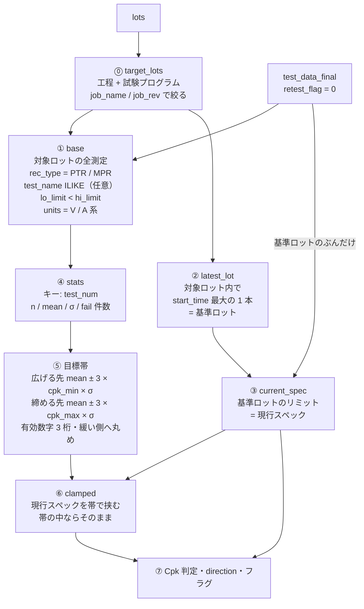
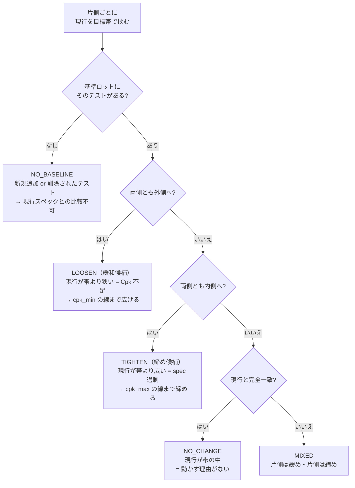
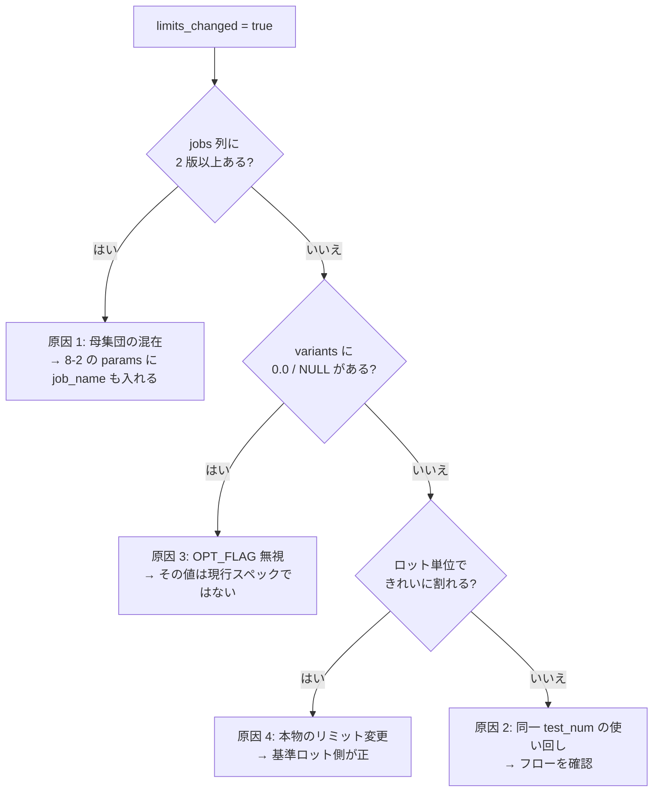

# サンプル SQL クエリ集

`schema.md` で定義された 5 テーブル（`lots` / `wafers` / `parts` / `test_data` /
`chipid`）を DuckDB ビュー経由で検索する際のリファレンスです。

> [!IMPORTANT]
> **歩留り・解析は原則 `*_final` ビューを使ってください。**
> 生テーブル（`parts` / `test_data`）はリテストの**全試行**を含むため、そのまま
> 集計すると二重計上になります。`parts_final` / `test_data_final` /
> `chipid_final` は「ダイ/パッケージごとに最新リテストのみ」へ重複排除済みです。
> `wafers` の `part_count` / `good_count` は WRR の報告値（リテストは部分母集団・
> FT には存在しない）なので、**歩留りは `parts_final` から算出**します。
>
> **`test_data_final` の行セマンティクスに注意**: 重複排除は ingest 時点で
> 付与される `retest_flag`（`storage.py`）によるもので、`test_data_final` は
> `WHERE retest_flag = 0` の単純フィルタです（`parts_final` / `chipid_final` は
> 従来どおり `ROW_NUMBER()` ウィンドウ）。そのため、旧実装と異なり **(die, test,
> pin) につき複数行が残ることがあります**（例: OTP ダンプの 1 test_num に対する
> 512 個のループ計測）。反復回を区別するには `exec_seq`（run 内 0 始まり出現順）
> を使い、1 テストにつき 1 値が欲しい場合は `exec_seq` で絞るか集約してください。

## 実行方法

### VS Code で対話的に実行（推奨）

プロジェクトルートの **`query.py`** を VS Code で開き、各セル (`# %%`) を Shift+Enter で実行します。
[Python 拡張](https://marketplace.visualstudio.com/items?itemName=ms-python.python) + Jupyter サポートが必要です。
`query.py` は gitignore された個人スクラッチです — 初回やリポジトリ更新後は
`cp query.py.example query.py` でテンプレートから最新化してください。

```
# セットアップセルを実行後、LOT_ID を書き換えて各セルを実行
LOT_ID = "E6A773.00"
```

> [!TIP]
> **`test_data_final` はもう遅くありません**：ingest 時に付与される `retest_flag`
> による単純フィルタなので、`test_name LIKE` などロット絞り込みクエリも通常の
> Parquet スキャンと同じ速さです（`test_data_final` を毎クエリ `ROW_NUMBER()` で
> 再計算していた旧実装では、ロット単位の `test_name` 検索が実データで 12 分以上
> かかっていました）。
>
> **`parts_final` / `chipid_final` は引き続き `ROW_NUMBER()` ウィンドウ**です
> （小テーブルなのでコストは無視できる範囲）。同じロットへ繰り返しクエリする
> 場合は `use_lot('LOT_ID')` を呼ぶと、そのロットの `parts_final` /
> `test_data_final` / `chipid_final` をメモリ上の表に materialize し、クエリ
> ごとの Parquet 再スキャン（特にネットワーク共有上のストアで重い）を回避
> できます。全ロットに戻すには `use_all()`。
> 全件を Python に取り込む場合は `q(sql, limit=0, as_arrow=True)`（pandas 変換を
> 省いて約 3.5 倍）か、ファイル出力なら `to_csv(sql)` を使ってください。

### CLI から直接実行

```bash
# DuckDB シェル（対話モード）
stdf db shell

# 1 クエリを実行して表示
stdf db query "SELECT lot_id, product FROM lots ORDER BY start_time DESC LIMIT 10"
```

### Python スクリプトから（`*_final` ビューの定義込み）

`stdf db` / `query.py` は `*_final` を自動定義しますが、素の DuckDB から使う場合は
以下のように生ビューと派生ビューを作成します。

```python
import duckdb
con = duckdb.connect(":memory:")

for t in ["lots", "wafers", "parts", "test_data", "chipid"]:
    # test_data alone can mix pre-flag files (no exec_seq/retest_flag columns)
    # with new ones; union_by_name fills the missing columns with NULL instead
    # of erroring on schema mismatch.
    extra = ", union_by_name=true" if t == "test_data" else ""
    con.execute(f"""
        CREATE OR REPLACE VIEW {t} AS
        SELECT * FROM read_parquet('data/{t}/**/*.parquet', hive_partitioning=true{extra})
    """)

# dedup identity: CP=ダイ座標 / FT=パッケージ 2D バーコード
DEDUP = ("CASE WHEN test_category = 'FT' THEN part_txt "
         "ELSE CONCAT(wafer_id, '|', x_coord, '|', y_coord) END")

con.execute(f"""
    CREATE OR REPLACE VIEW parts_final AS
    SELECT * EXCLUDE (rn) FROM (
        SELECT *, ROW_NUMBER() OVER (
            PARTITION BY lot_id, {DEDUP} ORDER BY retest_num DESC) AS rn
        FROM parts) WHERE rn = 1
""")
# test_data_final is NOT a window: dedup happens at ingest time (storage.py
# writes retest_flag per row), so this is a plain predicate filter — cheap,
# and pushed into the Parquet scan. Rows with retest_flag IS NULL (pre-flag
# files) are excluded; that store needs a re-ingest (see stdf db verify-flags).
con.execute("""
    CREATE OR REPLACE VIEW test_data_final AS
    SELECT * FROM test_data WHERE retest_flag = 0
""")
con.execute("""
    CREATE OR REPLACE VIEW chipid_final AS
    SELECT * EXCLUDE (rn) FROM (
        SELECT *, ROW_NUMBER() OVER (
            PARTITION BY lot_id, efuse_raw ORDER BY retest_num DESC) AS rn
        FROM chipid) WHERE rn = 1
""")
```

---

> [!TIP]
> パーティション列（`product`, `test_category`, `sub_process`, `lot_id`,
> `wafer_id`, `retest`）で絞ると高速です。

---

## 1. テストプログラム Check Out

### 1-1. テストプログラム名・リビジョン一覧

```sql
SELECT DISTINCT product, sub_process, job_name, job_rev
FROM lots
ORDER BY product, sub_process, job_name, job_rev;
```

### 1-2. 特定プログラムの最新リビジョンを確認

```sql
SELECT product, sub_process, job_name, job_rev,
       MAX(start_time) AS last_used
FROM lots
GROUP BY product, sub_process, job_name, job_rev
ORDER BY last_used DESC;
```

### 1-3. 特定ロットのテストプログラム情報

```sql
SELECT lot_id, product, sub_process, job_name, job_rev,
       tester_type, operator, start_time, finish_time
FROM lots
WHERE lot_id = 'YOUR_LOT_ID';
```

### 1-4. 特定ロットのテストプログラムと全データ一括取得

ロット → ダイ（最新リテスト）→ 測定値を 1 クエリで取得します。`parts_final` /
`test_data_final` を使うのでリテストは最新のみ。

```sql
SELECT
    l.lot_id, l.product, l.sub_process, l.job_name, l.job_rev,
    l.tester_type, l.operator,
    -- ダイ情報（最新リテスト）
    p.part_id, p.wafer_id, p.part_txt,
    p.x_coord, p.y_coord, p.hard_bin, p.soft_bin,
    p.passed AS die_passed, p.retest_num,
    -- テスト測定値（最新リテスト）
    td.test_num, td.test_name, td.rec_type,
    td.result, td.lo_limit, td.hi_limit, td.units,
    td.passed AS test_passed
FROM lots l
JOIN parts_final p      ON l.lot_id = p.lot_id
JOIN test_data_final td ON p.lot_id = td.lot_id AND p.part_id = td.part_id
WHERE l.lot_id = 'YOUR_LOT_ID'
ORDER BY p.wafer_id, p.part_id, td.test_num;
```

> [!TIP]
> 行数が多い場合は `COPY (...) TO 'output.csv' (HEADER)` で CSV 出力するか、
> `WHERE p.wafer_id = '...'` を追加して絞ると扱いやすくなります。

---

## 2. ロット検索

### 2-1. 製品 × 工程でロット一覧

```sql
SELECT lot_id, product, sub_process, start_time, finish_time, job_name, job_rev
FROM lots
WHERE product = 'YOUR_PRODUCT' AND sub_process = 'CP1'
ORDER BY start_time DESC;
```

### 2-2. 期間指定でロット検索

```sql
SELECT *
FROM lots
WHERE start_time >= TIMESTAMP '2025-01-01'
  AND start_time <  TIMESTAMP '2025-02-01'
ORDER BY start_time;
```

### 2-3. ロット歩留りサマリ（CP / FT 両対応・retest 反映）

`parts_final` から算出するので、CP も FT も同じクエリで正しい最終歩留りが出ます。

```sql
SELECT
    l.lot_id, l.product, l.test_category, l.sub_process, l.job_name,
    COUNT(*)                                              AS dies,
    SUM(CASE WHEN p.passed THEN 1 ELSE 0 END)             AS good,
    ROUND(100.0 * SUM(CASE WHEN p.passed THEN 1 ELSE 0 END)
          / NULLIF(COUNT(*), 0), 2)                       AS yield_pct
FROM lots l
JOIN parts_final p ON l.lot_id = p.lot_id
GROUP BY l.lot_id, l.product, l.test_category, l.sub_process, l.job_name
ORDER BY l.product, l.test_category, yield_pct;
```

---

## 3. ウェーハ / 歩留り（CP）

### 3-1. ロット内ウェーハ別歩留り（retest 反映 / parts_final 由来）

```sql
SELECT
    wafer_id,
    COUNT(*)                                             AS dies,
    SUM(CASE WHEN passed THEN 1 ELSE 0 END)              AS good,
    ROUND(100.0 * SUM(CASE WHEN passed THEN 1 ELSE 0 END)
          / NULLIF(COUNT(*), 0), 2)                      AS yield_pct
FROM parts_final
WHERE lot_id = 'YOUR_LOT_ID'
GROUP BY wafer_id
ORDER BY yield_pct;
```

### 3-2. 歩留り低下ウェーハの抽出（90% 未満）

```sql
SELECT wafer_id, COUNT(*) AS dies,
       SUM(CASE WHEN passed THEN 1 ELSE 0 END) AS good,
       ROUND(100.0 * SUM(CASE WHEN passed THEN 1 ELSE 0 END)
             / NULLIF(COUNT(*), 0), 2) AS yield_pct
FROM parts_final
WHERE lot_id = 'YOUR_LOT_ID'
GROUP BY wafer_id
HAVING ROUND(100.0 * SUM(CASE WHEN passed THEN 1 ELSE 0 END)
             / NULLIF(COUNT(*), 0), 2) < 90
ORDER BY yield_pct;
```

### 3-3. WRR 報告値 vs 実測（parts）歩留りの突合

`wafers`（WRR）と `parts_final` の歩留りが食い違う＝リテストや欠損の兆候。

```sql
SELECT
    w.wafer_id,
    w.good_count                                  AS wrr_good,
    w.part_count                                  AS wrr_total,
    p.good                                        AS parts_good,
    p.dies                                        AS parts_total,
    ROUND(100.0 * w.good_count / NULLIF(w.part_count, 0), 2) AS wrr_yield,
    ROUND(100.0 * p.good / NULLIF(p.dies, 0), 2)            AS parts_yield
FROM (
    SELECT *, ROW_NUMBER() OVER (
        PARTITION BY lot_id, wafer_id ORDER BY retest_num DESC) AS rn
    FROM wafers WHERE lot_id = 'YOUR_LOT_ID'
) w
JOIN (
    SELECT wafer_id, COUNT(*) AS dies,
           SUM(CASE WHEN passed THEN 1 ELSE 0 END) AS good
    FROM parts_final WHERE lot_id = 'YOUR_LOT_ID'
    GROUP BY wafer_id
) p ON w.wafer_id = p.wafer_id
WHERE w.rn = 1
ORDER BY ABS(wrr_yield - parts_yield) DESC;
```

### 3-4. ウェーハマップ（die 座標 × bin）

ヒートマップ／ウェーハマップ描画用の素データ。

```sql
SELECT x_coord, y_coord, hard_bin, soft_bin, passed
FROM parts_final
WHERE lot_id = 'YOUR_LOT_ID' AND wafer_id = 'YOUR_WAFER_ID'
ORDER BY y_coord, x_coord;
```

### 3-5. ウェーハ中心 vs エッジの歩留り（ゾーン分析）

エッジ不良の傾向を見る。半径はウェーハ座標系に合わせて調整。

```sql
WITH d AS (
    SELECT *,
           SQRT(POWER(x_coord, 2) + POWER(y_coord, 2)) AS r
    FROM parts_final
    WHERE lot_id = 'YOUR_LOT_ID' AND wafer_id = 'YOUR_WAFER_ID'
)
SELECT
    CASE WHEN r <= 50 THEN '1_center'
         WHEN r <= 90 THEN '2_middle'
         ELSE '3_edge' END                          AS zone,
    COUNT(*)                                         AS dies,
    SUM(CASE WHEN passed THEN 1 ELSE 0 END)          AS good,
    ROUND(100.0 * SUM(CASE WHEN passed THEN 1 ELSE 0 END)
          / NULLIF(COUNT(*), 0), 2)                  AS yield_pct
FROM d
GROUP BY zone
ORDER BY zone;
```

---

## 4. ダイ / ビン分析

### 4-1. ウェーハ内の Fail ダイ一覧

```sql
SELECT part_id, x_coord, y_coord, hard_bin, soft_bin, test_count, test_time
FROM parts_final
WHERE lot_id = 'YOUR_LOT_ID' AND wafer_id = 'YOUR_WAFER_ID' AND passed = FALSE
ORDER BY hard_bin, soft_bin;
```

### 4-2. ビン分布（ウェーハ単位）

```sql
SELECT hard_bin, soft_bin,
       COUNT(*)                                          AS die_count,
       ROUND(COUNT(*) * 100.0 / SUM(COUNT(*)) OVER (), 2) AS pct
FROM parts_final
WHERE lot_id = 'YOUR_LOT_ID' AND wafer_id = 'YOUR_WAFER_ID'
GROUP BY hard_bin, soft_bin
ORDER BY hard_bin, soft_bin;
```

### 4-3. ソフトビン・パレート（累積 % 付き）

不良ビンの寄与度を上位から。歩留り改善の優先順位付けに。

```sql
SELECT
    soft_bin,
    COUNT(*)                                                  AS die_count,
    ROUND(100.0 * COUNT(*) / SUM(COUNT(*)) OVER (), 2)        AS pct,
    ROUND(100.0 * SUM(COUNT(*)) OVER (ORDER BY COUNT(*) DESC)
          / SUM(COUNT(*)) OVER (), 2)                         AS cumulative_pct
FROM parts_final
WHERE lot_id = 'YOUR_LOT_ID' AND passed = FALSE
GROUP BY soft_bin
ORDER BY die_count DESC;
```

### 4-4. 隣接 Fail のクラスタ検出（同一座標近傍の連続不良）

Fail die の上下左右いずれかに別の Fail がある＝クラスタ不良の候補。

```sql
WITH f AS (
    SELECT x_coord, y_coord
    FROM parts_final
    WHERE lot_id = 'YOUR_LOT_ID' AND wafer_id = 'YOUR_WAFER_ID'
      AND passed = FALSE
)
SELECT a.x_coord, a.y_coord,
       COUNT(b.x_coord) AS fail_neighbors
FROM f a
JOIN f b
  ON ABS(a.x_coord - b.x_coord) + ABS(a.y_coord - b.y_coord) = 1
GROUP BY a.x_coord, a.y_coord
ORDER BY fail_neighbors DESC, a.y_coord, a.x_coord;
```

---

## 5. パラメトリック測定（test_data）

> [!NOTE]
> `test_data_final` は最新 run の全行を保持します。ループ計測（例: 1 test_num
> の下に複数回書かれる OTP ワード）がある場合、同じ `(die, test_num, pin_num)`
> に複数行が残ります。反復回を区別したいときは `exec_seq`（run 内 0 始まり
> 出現順。OTP ワードインデックス等に対応）で `WHERE` するか、以下のサマリ系
> クエリのように `GROUP BY` / 集約関数で丸めてください。

### 5-1. 特定テスト項目の統計サマリ

```sql
SELECT
    test_num, test_name, units, lo_limit, hi_limit,
    COUNT(*)                  AS cnt,
    ROUND(AVG(result), 4)     AS avg_val,
    ROUND(STDDEV(result), 4)  AS stddev_val,
    ROUND(MIN(result), 4)     AS min_val,
    ROUND(MAX(result), 4)     AS max_val,
    ROUND(MEDIAN(result), 4)  AS median_val,
    ROUND(QUANTILE_CONT(result, 0.25), 4) AS q1,
    ROUND(QUANTILE_CONT(result, 0.75), 4) AS q3
FROM test_data_final
WHERE lot_id = 'YOUR_LOT_ID' AND test_name = 'YOUR_TEST_NAME'
GROUP BY test_num, test_name, units, lo_limit, hi_limit;
```

### 5-2. 規格外（Fail）テストの抽出

```sql
SELECT part_id, x_coord, y_coord, test_num, test_name,
       result, lo_limit, hi_limit, units
FROM test_data_final
WHERE lot_id = 'YOUR_LOT_ID' AND wafer_id = 'YOUR_WAFER_ID' AND passed = 'F'
ORDER BY test_num, part_id;
```

### 5-3. テスト項目ごとの Fail 率ワーストランキング

```sql
SELECT
    test_num, test_name,
    COUNT(*)                                       AS total,
    SUM(CASE WHEN passed = 'F' THEN 1 ELSE 0 END)  AS fail_cnt,
    ROUND(SUM(CASE WHEN passed = 'F' THEN 1 ELSE 0 END)
          * 100.0 / COUNT(*), 2)                   AS fail_pct
FROM test_data_final
WHERE lot_id = 'YOUR_LOT_ID'
GROUP BY test_num, test_name
HAVING SUM(CASE WHEN passed = 'F' THEN 1 ELSE 0 END) > 0
ORDER BY fail_pct DESC;
```

### 5-4. 特定ダイの全テスト結果

```sql
SELECT test_num, test_name, rec_type, result, lo_limit, hi_limit, units, passed
FROM test_data_final
WHERE lot_id = 'YOUR_LOT_ID' AND part_id = 'YOUR_PART_ID'
ORDER BY test_num;
```

### 5-5. 規格マージン（限界に近いテスト＝歩留りリスク）

測定値が規格幅のどれだけ内側にあるか。`margin_pct` が小さいほど危険。

```sql
SELECT
    test_num, test_name, units, lo_limit, hi_limit,
    ROUND(AVG(result), 4)  AS mean,
    ROUND(100.0 * LEAST(AVG(result) - lo_limit, hi_limit - AVG(result))
          / NULLIF(hi_limit - lo_limit, 0), 2) AS margin_pct
FROM test_data_final
WHERE lot_id = 'YOUR_LOT_ID'
  AND lo_limit IS NOT NULL AND hi_limit IS NOT NULL
  AND rec_type IN ('PTR', 'MPR')
GROUP BY test_num, test_name, units, lo_limit, hi_limit
HAVING COUNT(*) > 1
ORDER BY margin_pct;
```

### 5-6. 外れ値検出（平均 ± 3σ を超えるダイ）

```sql
WITH stat AS (
    SELECT test_num, AVG(result) AS mu, STDDEV(result) AS sigma
    FROM test_data_final
    WHERE lot_id = 'YOUR_LOT_ID' AND test_name = 'YOUR_TEST_NAME'
    GROUP BY test_num
)
SELECT t.part_id, t.x_coord, t.y_coord, t.result,
       ROUND((t.result - s.mu) / NULLIF(s.sigma, 0), 2) AS z_score
FROM test_data_final t
JOIN stat s ON t.test_num = s.test_num
WHERE t.lot_id = 'YOUR_LOT_ID' AND t.test_name = 'YOUR_TEST_NAME'
  AND ABS(t.result - s.mu) > 3 * s.sigma
ORDER BY ABS(t.result - s.mu) DESC;
```

### 5-7. サイト間ばらつき（site-to-site）

`site_num`（parts 側）別にテスト平均を比較。テスター間差・ハンドラ差の検出。

```sql
SELECT
    p.site_num,
    td.test_name,
    COUNT(*)                 AS n,
    ROUND(AVG(td.result), 4) AS mean,
    ROUND(STDDEV(td.result), 4) AS sigma
FROM test_data_final td
JOIN parts_final p ON td.lot_id = p.lot_id AND td.part_id = p.part_id
WHERE td.lot_id = 'YOUR_LOT_ID' AND td.test_name = 'YOUR_TEST_NAME'
GROUP BY p.site_num, td.test_name
ORDER BY p.site_num;
```

### 5-8. 2 テスト項目間の相関

```sql
WITH pivoted AS (
    SELECT part_id,
           MAX(CASE WHEN test_name = 'TEST_A' THEN result END) AS a,
           MAX(CASE WHEN test_name = 'TEST_B' THEN result END) AS b
    FROM test_data_final
    WHERE lot_id = 'YOUR_LOT_ID' AND test_name IN ('TEST_A', 'TEST_B')
    GROUP BY part_id
)
SELECT
    COUNT(*)                       AS n,
    ROUND(CORR(a, b), 4)           AS pearson_r,
    ROUND(REGR_SLOPE(b, a), 6)     AS slope,
    ROUND(REGR_INTERCEPT(b, a), 6) AS intercept
FROM pivoted
WHERE a IS NOT NULL AND b IS NOT NULL;
```

### 5-9. MPR ピン別の分布（マルチピン測定）

```sql
SELECT pin_num, pin_name, units,
       COUNT(*)                 AS n,
       ROUND(AVG(result), 4)    AS mean,
       ROUND(STDDEV(result), 4) AS sigma
FROM test_data_final
WHERE lot_id = 'YOUR_LOT_ID' AND rec_type = 'MPR'
  AND test_name = 'YOUR_TEST_NAME'
GROUP BY pin_num, pin_name, units
ORDER BY pin_num;
```

---

## 6. リテスト分析

### 6-1. リテスト回数の分布（最終 retest_num 別ダイ数）

```sql
SELECT retest_num, COUNT(*) AS dies
FROM parts_final
WHERE lot_id = 'YOUR_LOT_ID'
GROUP BY retest_num
ORDER BY retest_num;
```

### 6-2. リテストによる歩留り改善量（初回 vs 最終）

`retest_num = 0`（初回）と最終（parts_final）の合否を比較。

```sql
WITH first AS (
    SELECT lot_id, wafer_id, x_coord, y_coord, part_txt, passed AS passed0
    FROM parts
    WHERE lot_id = 'YOUR_LOT_ID' AND retest_num = 0
),
final AS (
    SELECT lot_id, wafer_id, x_coord, y_coord, part_txt, passed AS passed_final
    FROM parts_final
    WHERE lot_id = 'YOUR_LOT_ID'
)
SELECT
    COUNT(*)                                                   AS dies,
    SUM(CASE WHEN passed0 THEN 1 ELSE 0 END)                   AS good_run0,
    SUM(CASE WHEN passed_final THEN 1 ELSE 0 END)              AS good_final,
    SUM(CASE WHEN NOT passed0 AND passed_final THEN 1 ELSE 0 END) AS recovered_by_retest
FROM first f
JOIN final fn USING (lot_id, wafer_id, x_coord, y_coord, part_txt);
```

> [!NOTE]
> FT は `wafer_id` / 座標が空のため、結合キーは実質 `part_txt` で効きます。
> CP は `wafer_id` + 座標で die を一意化します。

### 6-3. リテストでも Fail のままのダイ（恒久不良）

```sql
SELECT wafer_id, part_txt, x_coord, y_coord, hard_bin, soft_bin, retest_num
FROM parts_final
WHERE lot_id = 'YOUR_LOT_ID' AND passed = FALSE AND retest_num > 0
ORDER BY wafer_id, y_coord, x_coord;
```

---

## 7. クロステーブル / 工程横断

### 7-1. ロット歩留りトレンド（日次・parts_final 由来）

```sql
SELECT
    DATE_TRUNC('day', l.start_time) AS test_date,
    l.product, l.sub_process,
    COUNT(DISTINCT l.lot_id)        AS lot_count,
    COUNT(*)                        AS dies,
    SUM(CASE WHEN p.passed THEN 1 ELSE 0 END) AS good,
    ROUND(100.0 * SUM(CASE WHEN p.passed THEN 1 ELSE 0 END)
          / NULLIF(COUNT(*), 0), 2) AS yield_pct
FROM lots l
JOIN parts_final p ON l.lot_id = p.lot_id
WHERE l.product = 'YOUR_PRODUCT'
GROUP BY test_date, l.product, l.sub_process
ORDER BY test_date;
```

### 7-2. テスター × オペレータ別の歩留り比較

```sql
SELECT
    l.tester_type, l.operator,
    COUNT(DISTINCT l.lot_id) AS lot_count,
    COUNT(*)                 AS dies,
    SUM(CASE WHEN p.passed THEN 1 ELSE 0 END) AS good,
    ROUND(100.0 * SUM(CASE WHEN p.passed THEN 1 ELSE 0 END)
          / NULLIF(COUNT(*), 0), 2) AS yield_pct
FROM lots l
JOIN parts_final p ON l.lot_id = p.lot_id
GROUP BY l.tester_type, l.operator
ORDER BY yield_pct;
```

### 7-3. Fail ビンとテスト項目の紐付け（fail-nonstop 対応）

> [!IMPORTANT]
> **fail してもテストを続行する設定（fail-nonstop / continue-on-fail）では、1 ダイが
> 複数のテストで落ちます。** 単純に `COUNT(*)` すると同じダイが各テストに計上され、
> 合計が不良ダイ数を超えます（合成データでは不良ダイ 79 個に対し 101 件）。
> 下のクエリは `COUNT(DISTINCT ダイ)` で数え、**`sole_fail_dies`（他は全部通っていて
> そのテストだけで落ちたダイ数）** を併記します。派生的に落ちたテストと原因テストを
> 切り分けるには、`fail_dies` より `sole_fail_dies` を見てください。

```sql
WITH fail AS (
    SELECT p.wafer_id, p.hard_bin, p.soft_bin, td.test_num, td.test_name,
           -- ダイ識別は views.py の _DEDUP_UNIT と同じ（CP=ウェーハ+座標 / FT=part_txt）。
           -- part_id はリテストファイルで振り直される可能性があるため使わない
           CONCAT_WS('|', p.wafer_id, p.x_coord, p.y_coord,
                     CASE WHEN p.x_coord = -32768 AND p.y_coord = -32768
                          THEN p.part_txt ELSE '' END) AS die_key
    FROM parts_final p
    JOIN test_data_final td
      ON  td.lot_id   = p.lot_id
      AND td.wafer_id = p.wafer_id
      AND td.x_coord  = p.x_coord
      AND td.y_coord  = p.y_coord
      AND (CASE WHEN p.x_coord  = -32768 AND p.y_coord  = -32768
                THEN p.part_txt  ELSE '' END)
        = (CASE WHEN td.x_coord = -32768 AND td.y_coord = -32768
                THEN td.part_txt ELSE '' END)
    WHERE p.lot_id = 'YOUR_LOT_ID'
      AND p.passed = FALSE
      AND td.passed = 'F'
),
die AS (   -- ダイごとの fail テスト数
    SELECT die_key, COUNT(DISTINCT test_num) AS n_fail_tests
    FROM fail GROUP BY die_key
),
bin_total AS (   -- ウェーハ × bin ごとの不良ダイ数（シェアの分母）
    SELECT wafer_id, soft_bin, COUNT(DISTINCT die_key) AS bin_fail_dies
    FROM fail GROUP BY wafer_id, soft_bin
)
SELECT
    f.wafer_id, f.hard_bin, f.soft_bin, f.test_num, f.test_name,
    COUNT(DISTINCT f.die_key)                                   AS fail_dies,
    COUNT(DISTINCT f.die_key) FILTER (WHERE d.n_fail_tests = 1) AS sole_fail_dies,
    ROUND(100.0 * COUNT(DISTINCT f.die_key)
          / ANY_VALUE(b.bin_fail_dies), 1)                      AS pct_of_bin
FROM fail f
JOIN die d USING (die_key)
JOIN bin_total b ON b.wafer_id = f.wafer_id AND b.soft_bin = f.soft_bin
GROUP BY f.wafer_id, f.hard_bin, f.soft_bin, f.test_num, f.test_name
ORDER BY f.wafer_id, f.soft_bin, fail_dies DESC;
```

> **ロット全体でまとめて見たいとき**は `wafer_id` を 3 箇所（`SELECT` の並び / `bin_total`
> の `GROUP BY` と join 条件 / 最終の `GROUP BY`）から外してください。`pct_of_bin` の
> 分母がロット単位の不良ダイ数になります。FT データ（`wafer_id = ''`）はもともと
> 1 グループにまとまるので、外しても結果は変わりません。

> **原理的な限界**: fail-nonstop で bin を決めるのは通常「**最初に**落ちたテスト」ですが、
> これは現在のスキーマでは復元できません。`test_data` に実行順の列がないためです
> （`exec_seq` は同一 `test_num` 内の出現順であって、テスト間の順序ではありません）。
> Parquet の物理行順は保存されていますが、DuckDB の並列スキャンで順序は保証されません。
> `test_num` の昇順が実行順と一致する運用なら `MIN(test_num)` で代用できます。

### 7-4. Fail 行の全件取得（bin 付き）

7-3 の集計の素データです。`passed = 'F'` の測定を 1 行も落とさずに取り出します。

```sql
SELECT
    td.lot_id, td.wafer_id, td.x_coord, td.y_coord, td.part_txt,
    p.hard_bin, p.soft_bin, p.passed AS die_passed,
    td.test_num, td.test_name, td.rec_type, td.exec_seq,
    td.result, td.lo_limit, td.hi_limit, td.units
FROM test_data_final td
LEFT JOIN parts_final p
  ON  p.lot_id   = td.lot_id
  AND p.wafer_id = td.wafer_id
  AND p.x_coord  = td.x_coord
  AND p.y_coord  = td.y_coord
  AND (CASE WHEN td.x_coord = -32768 AND td.y_coord = -32768
            THEN td.part_txt ELSE '' END)
    = (CASE WHEN p.x_coord  = -32768 AND p.y_coord  = -32768
            THEN p.part_txt  ELSE '' END)
WHERE td.lot_id = 'YOUR_LOT_ID'
  AND td.passed = 'F'
ORDER BY p.soft_bin, td.wafer_id, td.x_coord, td.y_coord, td.test_num, td.exec_seq;
```

**設計上のポイント**

- **`LEFT JOIN`** — bin が引けない行があっても fail 行を落としません。`soft_bin` が
  NULL で出たら `parts` 側の欠損を疑ってください。
- **`p.passed = FALSE` を条件にしていない** — リテストで復活したダイの fail も残ります。
  `die_passed` 列で区別してください。条件に入れると「最終的に良品になったダイの fail」が
  消えます。
- **`rec_type` を出力** — **FTR（機能試験）は `result` が NULL でも `passed = 'F'` で
  入ります**。bin の原因は FTR であることも多いので、`rec_type IN ('PTR','MPR')` で
  絞らないでください（8-2 は Cpk 計算用なので絞っていますが、fail 解析では別です）。
- **`exec_seq`** — ループ計測で同一ダイ・同一 `test_num` の複数行を区別できます。

> **リテスト前の fail も見たい場合**: `test_data_final` は最新 run のみです。過去 run で
> 落ちたが再測定で通ったテストは含まれません。全 run を見るには `test_data_final` を
> 生の `test_data` に置き換え、出力に `td.retest_flag`（0 = 最新 run / 1 以上 = 過去 run）
> を追加してください。

### 7-5. 複数ロットの歩留り比較

```sql
SELECT
    l.lot_id, l.job_rev,
    COUNT(*)                 AS dies,
    SUM(CASE WHEN p.passed THEN 1 ELSE 0 END) AS good,
    ROUND(100.0 * SUM(CASE WHEN p.passed THEN 1 ELSE 0 END)
          / NULLIF(COUNT(*), 0), 2) AS yield_pct
FROM lots l
JOIN parts_final p ON l.lot_id = p.lot_id
WHERE l.lot_id IN ('LOT_A', 'LOT_B', 'LOT_C')
GROUP BY l.lot_id, l.job_rev
ORDER BY yield_pct DESC;
```

---

## 8. Cp / Cpk 算出（工程能力）

### 8-1. ロット単位の Cp / Cpk（現行スペックに対する簡易版）

```sql
SELECT
    test_num, test_name, units, lo_limit, hi_limit,
    COUNT(*)                  AS n,
    ROUND(AVG(result), 6)     AS mean,
    ROUND(STDDEV(result), 6)  AS sigma,
    -- Cp = (USL - LSL) / (6σ)
    ROUND((hi_limit - lo_limit) / (6 * STDDEV(result)), 3) AS cp,
    -- Cpk = min((USL - μ)/3σ, (μ - LSL)/3σ)
    ROUND(LEAST(
        (hi_limit - AVG(result)) / (3 * STDDEV(result)),
        (AVG(result) - lo_limit) / (3 * STDDEV(result))
    ), 3) AS cpk
FROM test_data_final
WHERE lot_id = 'YOUR_LOT_ID'
  AND lo_limit IS NOT NULL AND hi_limit IS NOT NULL
  AND rec_type IN ('PTR', 'MPR')
GROUP BY test_num, test_name, units, lo_limit, hi_limit
HAVING COUNT(*) > 1
ORDER BY cpk;
```

> Cpk < 1.33 はマージン不足の目安。`5-5`（規格マージン）と併せて確認します。

### 8-2. 次期プログラム向けスペック検討（Cpk < 1.33 の洗い出し）

現行データから **Cp / Cpk が 1.33 を割っているテストを洗い出し**、新しいリミット候補を
**目標帯**（`mean ± 3 × cpk_min × σ` 〜 `mean ± 3 × cpk_max × σ`）で算出します。
現行スペックが帯の中なら動かさず、狭すぎれば広げ、広すぎれば締めます。あわせて **pass/fail 件数**と、その現行
リミットが**どのテストプログラムのものか**を突き合わせます。8-1 との違い:

| | 8-1 | 8-2 |
|---|---|---|
| 母集団 | 1 ロット | 工程 × 試験プログラムで絞ったロット全部 |
| 現行スペック | 行が持つリミットで `GROUP BY` | **基準ロット**（`start_time` 最大）のリミット |
| 出力 | Cp / Cpk | + 新リミット候補 / fail 件数 / プログラム版 |

> [!IMPORTANT]
> **`test_category` と `sub_process` は必ず指定してください。** 省略すると CP1 と CP2 の
> ように測定条件の違うデータが同じ `test_num` で混ざります。加えて全工程の Parquet を
> 読むことになり、集約キーに文字列が 3 本増えて実測 +31% 遅くなります。

**このクエリが答える 3 つの問い**

- *「Cpk が足りないテストはどれか」* — `cpk_current < cpk_min` で絞り、昇順に並べます。
  新リミット候補は `direction`（`LOOSEN` / `TIGHTEN` / `MIXED`）付きで出ます。
- *「そのスペックは最新か」* — リミットは STDF の PTR/MPR にロット（＝ファイル）ごとに
  記録されています。**基準ロット（`start_time` 最大）のリミットを「現行」**とし、Cp / Cpk と
  `direction` はこれに対して計算します。全ロットを通してリミットが変わっているかは
  `limits_changed` / `LIMIT_CHANGED` で示します。
- *「どのテストプログラムか」* — `lots.job_name` / `job_rev` を join し、基準ロットの版を
  `ref_lot_id` / `latest_job_name` / `latest_job_rev` に出します。逆に**特定の
  プログラム版だけを対象にしたい場合は `params` の `job_name` / `job_rev` に値を
  入れます**（`NULL` なら工程内の全版が対象）。指定するとロット集合・基準ロットの
  両方がその版に揃うので、プログラム改版をまたいだ母集団の混在を避けられます。
  使える値は 1-1 / 1-2 のクエリで確認してください。

**データの流れ**（丸数字は SQL 中の CTE コメントに対応）



**判定フロー**（`direction` 列）



```sql
WITH params AS (
    SELECT 'YOUR_PRODUCT'         AS product,
           'CP'                   AS test_category,   -- 必ず指定（上記 IMPORTANT）
           'CP1'                  AS sub_process,     -- 必ず指定
           -- 新リミットの目標帯。現行スペックがこの帯の外にあるときだけ動かす
           -- （帯の中なら NO_CHANGE）。σ 換算は 3 × Cpk
           CAST(1.33 AS DOUBLE)   AS cpk_min,   -- 下回るなら広げる（±3.99σ）
           CAST(3.00 AS DOUBLE)   AS cpk_max,   -- 上回るなら締める（±9σ）
           30                     AS min_n,             -- これ未満は LOW_SAMPLE
           -- テスト名のあいまい検索。ILIKE なので大文字小文字を区別しない。
           -- 例 CAST('%IDD%' AS VARCHAR) / NULL なら全テスト
           CAST(NULL AS VARCHAR)  AS test_name_like,
           -- 試験プログラムで絞る。NULL なら工程内の全プログラム版が対象。
           -- 使える値は 1-1 / 1-2 のクエリで確認できる
           CAST(NULL AS VARCHAR)  AS job_name,          -- 例 'PROG_A'
           CAST(NULL AS VARCHAR)  AS job_rev,           -- 例 'Rev04'
           -- 除外ロット。例 CAST('2620%' AS VARCHAR) / 不要なら NULL のまま
           CAST(NULL AS VARCHAR)  AS exclude_lot_pattern
),

-- ⓪ 対象ロット: 工程 + 試験プログラム + 除外パターンで確定させる。
--    以降の base / latest_lot は必ずこの集合に揃える
target_lots AS (
    SELECT l.lot_id, l.job_name, l.job_rev, l.start_time
    FROM lots l CROSS JOIN params pa
    WHERE l.product       = pa.product
      AND l.test_category = pa.test_category
      AND l.sub_process   = pa.sub_process
      AND (pa.job_name IS NULL OR l.job_name = pa.job_name)
      AND (pa.job_rev  IS NULL OR l.job_rev  = pa.job_rev)
      AND (pa.exclude_lot_pattern IS NULL
           OR l.lot_id NOT LIKE pa.exclude_lot_pattern)
),

-- ① 母集団: 対象ロットの全測定（最新 run のみ = test_data_final）
base AS (
    SELECT td.test_num, td.test_name, td.units,
           td.lo_limit, td.hi_limit, td.result, td.passed
    FROM test_data_final td CROSS JOIN params pa
    WHERE td.product       = pa.product
      AND td.test_category = pa.test_category
      AND td.sub_process   = pa.sub_process
      AND td.rec_type IN ('PTR', 'MPR')
      AND td.lot_id IN (SELECT lot_id FROM target_lots)
      AND (pa.test_name_like IS NULL OR td.test_name ILIKE pa.test_name_like)
      AND td.result IS NOT NULL   AND isfinite(td.result)
      AND td.lo_limit IS NOT NULL AND isfinite(td.lo_limit)
      AND td.hi_limit IS NOT NULL AND isfinite(td.hi_limit)
      AND td.lo_limit < td.hi_limit   -- リミット無しテストの (0,0) もここで落ちる
      -- 単位は V / A 系のみ（V, MV, UV, NA, PA … 接頭辞 1 文字まで許容）。
      -- 全テストを対象にするならこの 1 行を削除
      AND regexp_matches(UPPER(TRIM(td.units)), '^.?[VA]$')
),

-- ② 基準ロット: 対象ロット内で start_time 最大の 1 本
--    lot_id はタイブレーク。start_time が同値のロットがあると基準ロットが
--    実行ごとに変わり、現行スペックが揺れるため
latest_lot AS (
    SELECT lot_id, job_name, job_rev
    FROM (
        SELECT l.*, ROW_NUMBER() OVER (
                   ORDER BY l.start_time DESC, l.lot_id DESC) AS rn
        FROM target_lots l
    ) WHERE rn = 1
),

-- ③ 現行スペック = 基準ロットが持っていたリミット（テスタが実際に適用した値）
--    lot_id はパーティション列なので、基準ロットのぶんだけ読めば済む（実測 0.02 s）
current_spec AS (
    SELECT td.test_num,
           ANY_VALUE(td.lo_limit) AS cur_lsl,
           ANY_VALUE(td.hi_limit) AS cur_usl
    FROM test_data_final td CROSS JOIN params pa
    WHERE td.product       = pa.product
      AND td.test_category = pa.test_category
      AND td.sub_process   = pa.sub_process
      AND td.lot_id        = (SELECT lot_id FROM latest_lot)
      AND td.rec_type IN ('PTR', 'MPR')
      AND td.lo_limit IS NOT NULL AND isfinite(td.lo_limit)
      AND td.hi_limit IS NOT NULL AND isfinite(td.hi_limit)
      AND td.lo_limit < td.hi_limit
    GROUP BY ALL
),

-- ④ 統計
stats AS (
    SELECT
        test_num,
        ANY_VALUE(test_name)                 AS test_name,
        ANY_VALUE(units)                     AS units,
        COUNT(*)                             AS n,
        COUNT(*) FILTER (WHERE passed = 'F') AS fail_n,
        AVG(result)                          AS mean,
        STDDEV_SAMP(result)                  AS sigma,
        MIN(result)                          AS min_val,
        MAX(result)                          AS max_val,
        -- リミット変更検知。COUNT(DISTINCT ...) は行ごとにハッシュ集合を作るため
        -- 高い。MIN/MAX の不一致で等価に判定できる
        MIN(lo_limit)                        AS lo_limit_min,
        MAX(lo_limit)                        AS lo_limit_max,
        MIN(hi_limit)                        AS hi_limit_min,
        MAX(hi_limit)                        AS hi_limit_max
    FROM base
    GROUP BY ALL
    HAVING COUNT(*) > 1
),

-- ⑤ 新リミット候補 = 目標帯の 2 本の線
--    広げる先 mean ± 3 × cpk_min × σ / 締める先 mean ± 3 × cpk_max × σ。
--    現行スペックをこの 2 本で挟む（帯の中ならそのまま）
candidate AS (
    SELECT s.*, cs.cur_lsl, cs.cur_usl,
           ll.lot_id   AS ref_lot_id,
           ll.job_name AS latest_job_name,
           ll.job_rev  AS latest_job_rev,
           pa.cpk_min, pa.cpk_max, pa.min_n,
           s.mean - 3.0 * pa.cpk_min * s.sigma AS lsl_widen_exact,
           s.mean - 3.0 * pa.cpk_max * s.sigma AS lsl_tight_exact,
           s.mean + 3.0 * pa.cpk_min * s.sigma AS usl_widen_exact,
           s.mean + 3.0 * pa.cpk_max * s.sigma AS usl_tight_exact
    FROM stats s
    CROSS JOIN (SELECT cpk_min, cpk_max, min_n FROM params) pa
    CROSS JOIN latest_lot ll
    LEFT JOIN current_spec cs USING (test_num)
    WHERE s.sigma IS NOT NULL AND isfinite(s.sigma) AND s.sigma > 0
),
rounded AS (
    SELECT c.*,
           -- 表示桁数。ROUND(x, 6) 固定だと ILPP のような 1e-6 〜 1e-9 の
           -- 微小電流が 0 に丸められてしまうため、そのテスト自身のスケール
           -- （mean と sigma の小さいほう）から小数桁を決める。
           -- 例 sigma = 2.5e-9 → 15 桁。1 以上のスケールでは従来どおり 6 桁
           GREATEST(6, 6 - CAST(FLOOR(LOG10(LEAST(
               NULLIF(ABS(c.mean), 0), c.sigma))) AS INTEGER)) AS disp_digits,
           -- 帯の 4 本を有効数字 3 桁へ丸める。LSL は FLOOR / USL は CEIL なので
           -- 常に「緩い側」に丸まる（丸めで意図せず厳しくならない）。
           -- 丸めは現行値ではなく帯の線にだけかける。現行値を丸めると、
           -- 動かさない項目まで cur とズレて NO_CHANGE にならなくなる
           CASE WHEN lsl_widen_exact = 0 THEN 0 ELSE
                FLOOR(lsl_widen_exact / POW(10, FLOOR(LOG10(ABS(lsl_widen_exact))) - 2))
                     * POW(10, FLOOR(LOG10(ABS(lsl_widen_exact))) - 2) END AS lsl_widen,
           CASE WHEN lsl_tight_exact = 0 THEN 0 ELSE
                FLOOR(lsl_tight_exact / POW(10, FLOOR(LOG10(ABS(lsl_tight_exact))) - 2))
                     * POW(10, FLOOR(LOG10(ABS(lsl_tight_exact))) - 2) END AS lsl_tight,
           CASE WHEN usl_widen_exact = 0 THEN 0 ELSE
                CEIL(usl_widen_exact / POW(10, FLOOR(LOG10(ABS(usl_widen_exact))) - 2))
                     * POW(10, FLOOR(LOG10(ABS(usl_widen_exact))) - 2) END AS usl_widen,
           CASE WHEN usl_tight_exact = 0 THEN 0 ELSE
                CEIL(usl_tight_exact / POW(10, FLOOR(LOG10(ABS(usl_tight_exact))) - 2))
                     * POW(10, FLOOR(LOG10(ABS(usl_tight_exact))) - 2) END AS usl_tight
    FROM candidate c
),

-- ⑥ 現行スペックを帯で挟む。GREATEST / LEAST は NULL を無視するので、
--    NOT_IN_LATEST_LOT の行は cpk_min の線がそのまま出る
clamped AS (
    SELECT r.*,
           GREATEST(LEAST(r.cur_lsl, r.lsl_widen), r.lsl_tight) AS new_lsl,
           LEAST(GREATEST(r.cur_usl, r.usl_widen), r.usl_tight) AS new_usl
    FROM rounded r
)

-- ⑦ 判定
SELECT
    test_num, test_name, units,

    -- 母集団と pass/fail
    n, fail_n,
    ROUND(100.0 * fail_n / NULLIF(n, 0), 3) AS fail_pct,

    -- 分布
    ROUND(mean, disp_digits)    AS mean,
    ROUND(sigma, disp_digits)   AS sigma,
    ROUND(min_val, disp_digits) AS min_val,
    ROUND(max_val, disp_digits) AS max_val,

    -- 現行スペック（基準ロット）とその出所
    -- STDF の限界値は元が 32bit float のため、DOUBLE に上がると
    -- 0.019999999999995529 のような表示になることがある。丸めは表示用のみ
    -- （cp_current / cpk_current は元の精度のまま計算している）
    ref_lot_id, latest_job_name, latest_job_rev,
    ROUND(cur_lsl, disp_digits) AS cur_lsl,
    ROUND(cur_usl, disp_digits) AS cur_usl,
    (lo_limit_min <> lo_limit_max
     OR hi_limit_min <> hi_limit_max) AS limits_changed,
    ROUND((cur_usl - cur_lsl) / (6 * sigma), 3) AS cp_current,
    -- LEAST は NULL を無視するため、片側だけ欠けていても値が出てしまう。
    -- 両側そろっている行だけ Cpk を出す
    CASE WHEN cur_lsl IS NULL OR cur_usl IS NULL THEN NULL ELSE
        ROUND(LEAST((cur_usl - mean) / (3 * sigma),
                    (mean - cur_lsl) / (3 * sigma)), 3) END AS cpk_current,

    -- 新スペック候補
    ROUND(new_lsl, disp_digits) AS new_lsl,
    ROUND(new_usl, disp_digits) AS new_usl,
    ROUND(new_lsl - cur_lsl, disp_digits) AS lsl_change,
    ROUND(new_usl - cur_usl, disp_digits) AS usl_change,

    CASE
        WHEN cur_lsl IS NULL OR cur_usl IS NULL       THEN 'NO_BASELINE'
        WHEN new_lsl <  cur_lsl AND new_usl >  cur_usl THEN 'LOOSEN'
        WHEN new_lsl >  cur_lsl AND new_usl <  cur_usl THEN 'TIGHTEN'
        WHEN new_lsl =  cur_lsl AND new_usl =  cur_usl THEN 'NO_CHANGE'
        ELSE 'MIXED'
    END AS direction,

    CONCAT_WS(',',
        CASE WHEN n < min_n                  THEN 'LOW_SAMPLE'        END,
        CASE WHEN cur_lsl IS NULL
               OR cur_usl IS NULL            THEN 'NOT_IN_LATEST_LOT' END,
        CASE WHEN lo_limit_min <> lo_limit_max
               OR hi_limit_min <> hi_limit_max
                                             THEN 'LIMIT_CHANGED'     END
    ) AS flags

FROM clamped
-- Cpk 不足のものだけ。全件見るならこの WHERE を削除
WHERE cpk_current IS NULL OR cpk_current < cpk_min
ORDER BY cpk_current NULLS LAST, test_num;
```

**読み方**

- `cpk_current` が小さい順に並びます。`NULL`（= `NO_BASELINE`）は基準ロットに
  そのテストが無く、現行スペックと比較できないものです。
- `direction = 'LOOSEN'` → 現行が帯より狭い（Cpk 不足）ので `cpk_min` の線まで
  広げる提案です。`min_val` / `max_val` と見比べて、実測レンジに対して妥当な
  広げ方かを確認します。データシート上限に当たるならここで手を止めてください。
- `direction = 'TIGHTEN'` → 現行が帯より広い（spec 過剰）ので `cpk_max` の線まで
  締める提案です。`min_val` / `max_val` が新リミットの内側に収まっているかが
  歯止めになります。
- `direction = 'NO_CHANGE'` → 現行スペックが帯の中に収まっており、動かす理由が
  ありません。`cpk_min` 〜 `cpk_max` を広く取るほどこれが増えます。
- `direction = 'MIXED'` → 片側だけ帯の外。分布が偏っていて、USL 側だけ余裕がある
  ようなケースです。
- `fail_n` / `fail_pct` はそのテスト単体の fail 件数・率です（`test_data.passed`）。
- `LIMIT_CHANGED` → そのテストのリミットは対象ロットの間で変更されています。
  `cur_lsl` / `cur_usl` は基準ロット（`ref_lot_id`、プログラム版は `latest_job_rev`）の
  ものです。`fail_n` はテスタが各ロットのリミットで判定した結果なので、この
  フラグが付いた行の `fail_n` は複数基準の混ぜ物になります。
- データシートとの突き合わせは、この出力を CSV に落として Excel 側で重ねて
  ください（`test_num` / `test_name` / `cur_lsl` / `cur_usl` / `new_lsl` / `new_usl`
  が揃っています）。

**既知の限界**

- **母集団は全ダイです**（良品ダイの選別はしていません）。他テストで不良になった
  ダイの測定値も σ に乗るため、Cpk は実力より**低め＝保守的**に出ます。そのテスト
  自体の不良は `fail_n` / `fail_pct` で確認できます。
- 全ロットプールの σ なので、厳密には Cpk ではなく **Ppk（overall performance）**
  相当です。ロット間シフトも σ に乗ります。
- `mean ± 3σ` は正規分布を前提にしています。リーク電流のように対数正規・片側裾を
  引く分布では新リミット候補が実測とかけ離れるので、`min_val` / `max_val` と必ず
  突き合わせてください。
- `lots` は lot_id ごとに 1 ファイルを上書きするため（`storage.py`）、同一ロットを
  複数回 ingest すると **最後に ingest したファイル**の `job_name` / `job_rev` が
  残ります。ingest 順であって時刻順ではないので、ロット内でプログラムが変わった
  ケースは追跡できません。
- パーサは PTR の `OPT_FLAG` を解釈せずリミット領域を読むため（`parser.py`）、
  リミット未定義のテストに 0 等が入り得ます。`lo_limit < hi_limit` で大半は
  落ちますが、`min_val` / `max_val` と突き合わせて確認してください。
- **`test_name` を突合キーにしないでください**（Excel で重ねるときも `test_num` で
  VLOOKUP します）。`parser.py` はテスト名をファイルごとに最初の PTR から 1 回だけ
  取りますが、STDF の TEST_TXT は任意フィールドなので、ロットによって空だったり
  プログラム改版で変わったりします。同じ `test_num` に複数の名前がぶら下がると
  `ANY_VALUE` がどれを返すか不定です。名前の揺れは次で確認できます:

  ```sql
  SELECT test_num, COUNT(DISTINCT test_name) AS name_variants,
         string_agg(DISTINCT '[' || test_name || ']', ' ') AS names
  FROM test_data_final
  WHERE product = 'YOUR_PRODUCT' AND test_category = 'CP' AND sub_process = 'CP1'
    AND rec_type IN ('PTR', 'MPR')
  GROUP BY 1 HAVING COUNT(DISTINCT test_name) > 1 ORDER BY 1;
  ```
- 集約キーは `test_num` のみで、`pin_num` は含めていません。MPR（ピンごとの測定）の
  テストは**全ピンが 1 つの分布にまとまります**。ピン別に見る必要がある場合は、
  `base` / `stats` / `current_spec` のキーと `LEFT JOIN ... USING` に `pin_num`
  （PTR は NULL なので `COALESCE(pin_num, -1)`）を足してください。
  対象データに MPR があるかは `SELECT COUNT(*) FROM test_data_final WHERE
  rec_type = 'MPR'` で確認できます。

**性能上の注意**

合成データ（`test_data` 800 万行）で測った、重い要素の単価です。本クエリは
`test_data` を 1 パス走査するだけなので、複数回参照によるマテリアライズも起きません
（メモリ量に依存しない）。

| 要素 | 追加時間 | 本クエリでの扱い |
|---|---|---|
| `MEDIAN` + `MAD`（robust 外れ値判定） | +0.95 s | 不採用 |
| `QUANTILE_CONT` × 2（IQR） | +0.48 s | 不採用 |
| パーティション列を集約キーに含める | +0.27 s | 不採用（工程を指定して回避） |
| `COUNT(DISTINCT ...)` × 3 | +0.44 s | 不採用（`MIN`/`MAX` で等価判定） |
| 分位点 / skewness | +0.34 s | 不採用 |
| 良品ダイ選別（`parts` との join） | +0.24 s | 不採用 |
| 逸脱 ppm の再走査 | +0.09 s | 不採用 |

### 8-3. 確認用 — 8-2 と同じ母集団の生データ取得

8-2 の集計値（`n` / `mean` / `sigma` / `fail_n`）を手元で検算するための、**行レベルの
ダンプ**です。`params` / `target_lots` と `base` の条件は 8-2 と**一字一句同じ**なので、
同じパラメータを入れれば必ず同じ母集団になります。

> [!WARNING]
> 母集団は測定 1 行 = 1 レコードです。工程まるごとだと数千万行になり得るので、
> **`test_name_like` で対象を絞ってください**。件数が多いときは
> `COPY (...) TO 'check.csv' (HEADER)` で CSV に落とします。

```sql
WITH params AS (
    SELECT 'YOUR_PRODUCT'         AS product,
           'CP'                   AS test_category,
           'CP1'                  AS sub_process,
           -- 確認したいテスト。8-2 の test_name 列から拾う。NULL で全テスト（重い）
           CAST('%VTH%' AS VARCHAR) AS test_name_like,
           CAST(NULL AS VARCHAR)  AS job_name,
           CAST(NULL AS VARCHAR)  AS job_rev,
           CAST(NULL AS VARCHAR)  AS exclude_lot_pattern
),

-- ⓪ 対象ロット（8-2 と同じ）
target_lots AS (
    SELECT l.lot_id, l.job_name, l.job_rev, l.start_time
    FROM lots l CROSS JOIN params pa
    WHERE l.product       = pa.product
      AND l.test_category = pa.test_category
      AND l.sub_process   = pa.sub_process
      AND (pa.job_name IS NULL OR l.job_name = pa.job_name)
      AND (pa.job_rev  IS NULL OR l.job_rev  = pa.job_rev)
      AND (pa.exclude_lot_pattern IS NULL
           OR l.lot_id NOT LIKE pa.exclude_lot_pattern)
)

-- ① 母集団（8-2 の base と同じ条件）
SELECT
    td.lot_id,
    td.wafer_id,
    td.x_coord,
    td.y_coord,
    td.part_txt,
    tl.job_name,
    tl.job_rev,
    td.test_num,
    td.test_name,
    td.units,
    td.rec_type,
    td.exec_seq,          -- ループ計測の識別（同一ダイ・同一 test_num で複数行）
    td.result,
    td.lo_limit,
    td.hi_limit,
    td.passed AS test_passed
FROM test_data_final td
JOIN target_lots tl ON tl.lot_id = td.lot_id
CROSS JOIN params pa
WHERE td.product       = pa.product
  AND td.test_category = pa.test_category
  AND td.sub_process   = pa.sub_process
  AND td.rec_type IN ('PTR', 'MPR')
  AND (pa.test_name_like IS NULL OR td.test_name ILIKE pa.test_name_like)
  AND td.result IS NOT NULL   AND isfinite(td.result)
  AND td.lo_limit IS NOT NULL AND isfinite(td.lo_limit)
  AND td.hi_limit IS NOT NULL AND isfinite(td.hi_limit)
  AND td.lo_limit < td.hi_limit
  AND regexp_matches(UPPER(TRIM(td.units)), '^.?[VA]$')
ORDER BY td.test_num, td.lot_id, td.wafer_id, td.x_coord, td.y_coord, td.exec_seq;
```

**8-2 の集計値との突合**

上のクエリを `dump` として、次を回すと 8-2 の `n` / `mean` / `sigma` / `fail_n` が
再現します。値が合わなければ、どちらかのパラメータがずれています。
**貼り付けるときは末尾の `;` を外してください**（サブクエリ内では構文エラーになります）。

```sql
SELECT
    test_num,
    COUNT(*)                                  AS n,
    COUNT(*) FILTER (WHERE test_passed = 'F') AS fail_n,
    -- 微小電流（1e-6 〜 1e-9）が 0 に潰れないよう、桁数は値のスケールに追従させる
    ROUND(AVG(result), GREATEST(6, 6 - CAST(FLOOR(LOG10(
        NULLIF(ABS(AVG(result)), 0))) AS INTEGER)))         AS mean,
    ROUND(STDDEV_SAMP(result), GREATEST(6, 6 - CAST(FLOOR(LOG10(
        NULLIF(STDDEV_SAMP(result), 0))) AS INTEGER)))      AS sigma
FROM (/* ↑ 8-3 のクエリをそのまま貼る */) dump
GROUP BY test_num
ORDER BY test_num;
```

**CSV に落とす**

```sql
COPY (/* ↑ 8-3 のクエリをそのまま貼る */) TO 'check.csv' (HEADER, DELIMITER ',');
```

**外れ値ダイの特定**

上の出力を `result` でソートすれば、**先頭行と末尾行が `min_val` / `max_val` の
該当ダイ**です（`lot_id` / `wafer_id` / `x_coord` / `y_coord` が同じ行に出ています）。
CSV に落として Excel でソートするか、`ORDER BY td.result` に変えてください。特定の
ウェーハの外周に固まっていればプローブ接触、ロット・ウェーハに散っていれば分布の裾
です。

### 8-4. 手直しした spec を CSV で戻して検証

8-2 の新リミット候補を**手で整えた結果**を CSV で読み戻し、8-2 と同じ母集団に当てて
影響を確認します。DuckDB が CSV を直接読めるので、コード追加は不要です。

```
8-2 → COPY で CSV 出力
        ↓ Excel で編集（丸め / データシート整合 / 外れ値の手当て）
      spec_review.csv   列: test_num, rev_lsl, rev_usl   ← 手直し後
        ↓
8-4 → 同じ母集団に当てて cpk_rev / fail 件数 / 新たに落ちるダイ数を出す
```

**現行スペックは 8-2 と同じく基準ロット（`start_time` 最大）のリミット**です。
`n_newly_fail` は「現行では通っていたか」の判定にこれを使います。データシートとの
突き合わせ（`SPEC_DIFF`）は 8-2 側で見てください。

**手順 1 — 候補を CSV に出す**

```sql
COPY (/* ↑ 8-2 のクエリを貼る。末尾の ; は外す */)
TO 'spec_candidate.csv' (HEADER, DELIMITER ',');
```

**手順 2 — Excel で手直し**

`new_lsl` / `new_usl` を編集し、**列名を `rev_lsl` / `rev_usl` に変えて**
`spec_review.csv` として保存します。読み込むのは次の 3 列だけです。

| 列名 | 型 | 内容 |
|---|---|---|
| `test_num` | 整数 | 8-2 の `test_num`。ここで突合する |
| `rev_lsl` | 数値 | 手直し後の下限 |
| `rev_usl` | 数値 | 手直し後の上限 |

`spec_review.csv` の中身（最小形）:

```csv
test_num,rev_lsl,rev_usl
1001,0.35,0.75
1002,38.4,569.0
1003,-1.06,-0.02
```

8-2 の出力をそのまま残して `new_lsl` / `new_usl` の**列名だけ**変えた形でも動きます
（余分な列は無視されます）:

```csv
test_num,test_name,units,n,cur_lsl,cur_usl,rev_lsl,rev_usl,flags
1001,Vth_N,V,4150,0.3,0.8,0.35,0.75,
1002,Idsat_N,UA,4150,200.0,400.0,38.4,569.0,
```

> [!IMPORTANT]
> - 保存形式は **「CSV UTF-8」**。Shift-JIS のままだと `test_name` が化けます。
> - **列名は小文字で完全一致**（`rev_lsl` / `rev_usl` / `test_num`）。`REV_LSL` や
>   `rev lsl` は認識されません。
> - `test_num` が指数表記（`1.23E+05`）にならないよう、セル書式は数値のままに。
> - **行を削れば「その test_num は検証対象外」**になり、`MISSING_IN_CSV` が付きます。
>   セルを空にした場合も同じ扱いです（`NULL` として読まれます）。
> - **同じ `test_num` の行を重複させないこと。** 重複していると `DUP_IN_CSV` が付き、
>   `rev_lsl` / `rev_usl` はそのうち 1 行が任意に採用されます。
> - `read_csv` のパスは DuckDB プロセスの作業ディレクトリ基準です。確実にするなら
>   絶対パス（Windows は `'C:/work/spec_review.csv'`、区切りは `/` でも動きます）。

**手順 3 — 検証**

`params` は **8-2 と同じ値を入れてください**（母集団が変わると数字の意味が変わります）。
`read_csv` のパスは定数でなければならないので、2 本とも直接書き換えます。

```sql
WITH params AS (
    SELECT 'YOUR_PRODUCT'         AS product,
           'CP'                   AS test_category,
           'CP1'                  AS sub_process,
           CAST(1.33 AS DOUBLE)   AS target_cpk,
           CAST(NULL AS VARCHAR)  AS test_name_like,
           CAST(NULL AS VARCHAR)  AS job_name,
           CAST(NULL AS VARCHAR)  AS job_rev,
           CAST(NULL AS VARCHAR)  AS exclude_lot_pattern
),

-- 手直し後のスペック。パスは定数のみ（params には入れられない）
--   GROUP BY で test_num ごと 1 行に潰している。手編集で同じ test_num が重複すると
--   join で母集団が二重になり n が倍になるため。重複は csv_rows > 1 = DUP_IN_CSV で出す
review AS (
    SELECT CAST(test_num AS BIGINT) AS test_num,
           ANY_VALUE(CAST(rev_lsl AS DOUBLE)) AS rev_lsl,
           ANY_VALUE(CAST(rev_usl AS DOUBLE)) AS rev_usl,
           COUNT(*)                           AS csv_rows
    FROM read_csv('spec_review.csv', header = true)
    GROUP BY 1
),

-- ⓪①②③ は 8-2 と同一
target_lots AS (
    SELECT l.lot_id, l.job_name, l.job_rev, l.start_time
    FROM lots l CROSS JOIN params pa
    WHERE l.product       = pa.product
      AND l.test_category = pa.test_category
      AND l.sub_process   = pa.sub_process
      AND (pa.job_name IS NULL OR l.job_name = pa.job_name)
      AND (pa.job_rev  IS NULL OR l.job_rev  = pa.job_rev)
      AND (pa.exclude_lot_pattern IS NULL
           OR l.lot_id NOT LIKE pa.exclude_lot_pattern)
),
base AS (
    SELECT td.test_num, td.test_name, td.units, td.result, td.passed
    FROM test_data_final td CROSS JOIN params pa
    WHERE td.product       = pa.product
      AND td.test_category = pa.test_category
      AND td.sub_process   = pa.sub_process
      AND td.rec_type IN ('PTR', 'MPR')
      AND td.lot_id IN (SELECT lot_id FROM target_lots)
      AND (pa.test_name_like IS NULL OR td.test_name ILIKE pa.test_name_like)
      AND td.result IS NOT NULL   AND isfinite(td.result)
      AND td.lo_limit IS NOT NULL AND isfinite(td.lo_limit)
      AND td.hi_limit IS NOT NULL AND isfinite(td.hi_limit)
      AND td.lo_limit < td.hi_limit
      AND regexp_matches(UPPER(TRIM(td.units)), '^.?[VA]$')
),
latest_lot AS (
    SELECT lot_id FROM (
        SELECT l.*, ROW_NUMBER() OVER (
                   ORDER BY l.start_time DESC, l.lot_id DESC) AS rn
        FROM target_lots l
    ) WHERE rn = 1
),
-- 現行スペック = 基準ロットのリミット（8-2 と同じ）
current_spec AS (
    SELECT td.test_num,
           ANY_VALUE(td.lo_limit) AS cur_lsl,
           ANY_VALUE(td.hi_limit) AS cur_usl
    FROM test_data_final td CROSS JOIN params pa
    WHERE td.product       = pa.product
      AND td.test_category = pa.test_category
      AND td.sub_process   = pa.sub_process
      AND td.lot_id        = (SELECT lot_id FROM latest_lot)
      AND td.rec_type IN ('PTR', 'MPR')
      AND td.lo_limit IS NOT NULL AND isfinite(td.lo_limit)
      AND td.hi_limit IS NOT NULL AND isfinite(td.hi_limit)
      AND td.lo_limit < td.hi_limit
    GROUP BY ALL
),

-- 手直し後リミットを同じ母集団に当てる
agg AS (
    SELECT b.test_num,
           ANY_VALUE(b.test_name) AS test_name,
           ANY_VALUE(b.units)     AS units,
           COUNT(*)               AS n,
           AVG(b.result)          AS mean,
           STDDEV_SAMP(b.result)  AS sigma,
           MIN(b.result)          AS min_val,
           MAX(b.result)          AS max_val,
           ANY_VALUE(cs.cur_lsl)  AS cur_lsl,
           ANY_VALUE(cs.cur_usl)  AS cur_usl,
           ANY_VALUE(r.rev_lsl)   AS rev_lsl,
           ANY_VALUE(r.rev_usl)   AS rev_usl,
           ANY_VALUE(r.csv_rows)  AS csv_rows,
           -- 現行スペックでの fail（テスタ判定）
           COUNT(*) FILTER (WHERE b.passed = 'F') AS fail_n_cur,
           -- 手直し後リミットを当てたときの fail
           COUNT(*) FILTER (WHERE b.result < r.rev_lsl
                              OR b.result > r.rev_usl) AS fail_n_rev,
           -- 現行では通るが手直し後は落ちる = 締めたことによる実害
           COUNT(*) FILTER (WHERE b.result >= cs.cur_lsl AND b.result <= cs.cur_usl
                              AND (b.result < r.rev_lsl
                                OR b.result > r.rev_usl)) AS n_newly_fail
    FROM base b
    LEFT JOIN review r       USING (test_num)
    LEFT JOIN current_spec cs USING (test_num)
    GROUP BY b.test_num
),
judged AS (
    SELECT a.* EXCLUDE (fail_n_rev, n_newly_fail), pa.target_cpk,
           -- CSV に無いテストは 0 件ではなく NULL（「影響なし」と誤読しないため）
           CASE WHEN a.rev_lsl IS NULL OR a.rev_usl IS NULL
                THEN NULL ELSE a.fail_n_rev   END AS fail_n_rev,
           -- n_newly_fail は現行スペックとの差分なので、基準ロット側が
           -- 欠けていても NULL（0 = 実害なし と読めてしまうため）
           CASE WHEN a.rev_lsl IS NULL OR a.rev_usl IS NULL
                  OR a.cur_lsl IS NULL OR a.cur_usl IS NULL
                THEN NULL ELSE a.n_newly_fail END AS n_newly_fail,
           LEAST((a.rev_usl - a.mean) / (3 * a.sigma),
                 (a.mean - a.rev_lsl) / (3 * a.sigma)) AS cpk_rev,
           -- 表示桁数（理由は 8-2 の disp_digits と同じ）
           GREATEST(6, 6 - CAST(FLOOR(LOG10(LEAST(
               NULLIF(ABS(a.mean), 0), a.sigma))) AS INTEGER)) AS disp_digits
    FROM agg a CROSS JOIN (SELECT target_cpk FROM params) pa
)

SELECT
    test_num, test_name, units, n,
    ROUND(mean, disp_digits)    AS mean,
    ROUND(sigma, disp_digits)   AS sigma,
    ROUND(min_val, disp_digits) AS min_val,
    ROUND(max_val, disp_digits) AS max_val,
    ROUND(cur_lsl, disp_digits) AS cur_lsl,
    ROUND(cur_usl, disp_digits) AS cur_usl,
    rev_lsl, rev_usl,
    ROUND(cpk_rev, 3) AS cpk_rev,
    fail_n_cur, fail_n_rev, n_newly_fail,
    ROUND(1000000.0 * fail_n_rev / NULLIF(n, 0), 1) AS fail_ppm_rev,
    CONCAT_WS(',',
        CASE WHEN rev_lsl IS NULL OR rev_usl IS NULL THEN 'MISSING_IN_CSV'   END,
        CASE WHEN cur_lsl IS NULL OR cur_usl IS NULL THEN 'NO_CURRENT_SPEC'  END,
        CASE WHEN csv_rows > 1                       THEN 'DUP_IN_CSV'       END,
        CASE WHEN rev_lsl >= rev_usl                 THEN 'INVERTED'         END,
        CASE WHEN min_val < rev_lsl
               OR max_val > rev_usl                  THEN 'OUTSIDE_MEASURED' END,
        CASE WHEN cpk_rev < target_cpk               THEN 'CPK_SHORT'        END
    ) AS flags
FROM judged
ORDER BY n_newly_fail DESC, cpk_rev NULLS FIRST, test_num;
```

**読み方**

- `n_newly_fail` — 現行スペックでは通っていたのに手直し後リミットでは落ちるダイ数。
  **締めたときの歩留り影響そのもの**なので、降順に並べています。`0` なら実害なし。
- `fail_n_rev` / `fail_ppm_rev` — 手直し後リミットを実測に当てた fail 件数・ppm。
  `fail_n_cur`（テスタが実際に落とした数）と比べて、緩めたのか締めたのかが分かります。
- `cpk_rev` — 手直し後リミットでの Cpk。`CPK_SHORT` は 8-2 の目的（1.33 確保）を
  満たしていないという意味です。
- `flags`
  - `MISSING_IN_CSV` — 母集団にはあるが CSV に無い（手直し漏れ、または意図的に除外）。
    このとき `fail_n_rev` / `n_newly_fail` は `0` ではなく `NULL` になります
  - `NO_CURRENT_SPEC` — 基準ロットにその `test_num` が無い（新規追加テストなど）。
    比較対象が無いので `n_newly_fail` は `NULL` になります
  - `DUP_IN_CSV` — `spec_review.csv` に同じ `test_num` の行が複数ある。どの値が使われたか不定なので
    CSV を直して再実行してください
  - `INVERTED` — `rev_lsl >= rev_usl`。Excel での編集ミス
  - `OUTSIDE_MEASURED` — 実測の `min_val` / `max_val` が手直し後リミットの外。
    `n_newly_fail` と合わせて、落とす気があるのか確認してください
  - `CPK_SHORT` — `cpk_rev < target_cpk`

**新たに落ちるダイの内訳**

`n_newly_fail` が付いたテストについて、どのウェーハのどの座標かを見るには、8-3 の
ダンプに同じ CSV を join します。

```sql
WITH review AS (
    SELECT CAST(test_num AS BIGINT) AS test_num,
           CAST(rev_lsl AS DOUBLE)  AS rev_lsl,
           CAST(rev_usl AS DOUBLE)  AS rev_usl
    FROM read_csv('spec_review.csv', header = true)
)
SELECT d.lot_id, d.wafer_id, d.x_coord, d.y_coord, d.part_txt,
       d.test_num, d.test_name, d.result,
       d.lo_limit, d.hi_limit, r.rev_lsl, r.rev_usl
FROM (/* ↑ 8-3 のクエリを貼る。末尾の ; は外す */) d
JOIN review r USING (test_num)
WHERE d.result BETWEEN d.lo_limit AND d.hi_limit      -- 現行では通っている
  AND (d.result < r.rev_lsl OR d.result > r.rev_usl)  -- 手直し後は落ちる
ORDER BY d.test_num, d.lot_id, d.wafer_id;
```

判定は行が持つリミット（そのロットで実際に適用された値）です。`LIMIT_CHANGED` の
テストでは、8-4 本体の `n_newly_fail`（基準ロットのリミット基準）と行数が
ずれることがあります。

### 8-5. 確認用 — CSV のテスト名リストで生データをまとめて取得

8-3 は 1 パターンずつしか絞れませんが、こちらは **CSV に列挙した複数の `test_name`**
をまとめて対象にします。8-2 / 8-4 の出力 CSV（`test_name` 列がある）をそのまま
使い回せます。母集団の条件（`params` / `target_lots` / `base` 相当）は 8-2 / 8-3 と
同じです。

> [!WARNING]
> 母集団は測定 1 行 = 1 レコードです。CSV に挙げるテスト数が多いほど行数が増えます。
> 件数が多いときは `COPY (...) TO 'check.csv' (HEADER)` で CSV に落としてください。

**入力 CSV（`test_list.csv`）の形式**

読むのは `test_name` 列だけです。他の列（8-2 / 8-4 の出力ならそのまま）があっても
無視されます。

```csv
test_name
Vth_N
Idsat_N
Leakage
```

> [!IMPORTANT]
> - `test_name` は**完全一致**です（8-3 の `ILIKE` のようなあいまい検索はしません）。
>   `test_data_final.test_name` の表記と 1 文字でも違うと拾えません。8-2 の出力
>   CSV から `test_name` 列をそのまま持ってくるのが確実です。
> - 保存形式は「CSV UTF-8」、列名は小文字で完全一致。

```sql
WITH params AS (
    SELECT 'YOUR_PRODUCT'         AS product,
           'CP'                   AS test_category,
           'CP1'                  AS sub_process,
           CAST(NULL AS VARCHAR)  AS job_name,
           CAST(NULL AS VARCHAR)  AS job_rev,
           CAST(NULL AS VARCHAR)  AS exclude_lot_pattern
),

-- ⓪ 対象ロット（8-2 / 8-3 と同じ）
target_lots AS (
    SELECT l.lot_id, l.job_name, l.job_rev, l.start_time
    FROM lots l CROSS JOIN params pa
    WHERE l.product       = pa.product
      AND l.test_category = pa.test_category
      AND l.sub_process   = pa.sub_process
      AND (pa.job_name IS NULL OR l.job_name = pa.job_name)
      AND (pa.job_rev  IS NULL OR l.job_rev  = pa.job_rev)
      AND (pa.exclude_lot_pattern IS NULL
           OR l.lot_id NOT LIKE pa.exclude_lot_pattern)
),

-- 対象テスト名（重複除去）。パスは定数のみ
test_list AS (
    SELECT DISTINCT test_name FROM read_csv('test_list.csv', header = true)
)

-- ① 母集団（8-2 の base と同じ条件。test_name_like の代わりに CSV の IN で絞る）
SELECT
    td.lot_id,
    td.wafer_id,
    td.x_coord,
    td.y_coord,
    td.part_txt,
    tl.job_name,
    tl.job_rev,
    td.test_num,
    td.test_name,
    td.units,
    td.rec_type,
    td.exec_seq,
    td.result,
    td.lo_limit,
    td.hi_limit,
    td.passed AS test_passed
FROM test_data_final td
JOIN target_lots tl ON tl.lot_id = td.lot_id
CROSS JOIN params pa
WHERE td.product       = pa.product
  AND td.test_category = pa.test_category
  AND td.sub_process   = pa.sub_process
  AND td.rec_type IN ('PTR', 'MPR')
  AND td.test_name IN (SELECT test_name FROM test_list)
  AND td.result IS NOT NULL   AND isfinite(td.result)
  AND td.lo_limit IS NOT NULL AND isfinite(td.lo_limit)
  AND td.hi_limit IS NOT NULL AND isfinite(td.hi_limit)
  AND td.lo_limit < td.hi_limit
  AND regexp_matches(UPPER(TRIM(td.units)), '^.?[VA]$')
ORDER BY td.test_num, td.lot_id, td.wafer_id, td.x_coord, td.y_coord, td.exec_seq;
```

CSV にあるが母集団に 1 行も無かったテスト名（表記違い・単位が V/A 系以外など）は、
結果に含まれず**サイレントに消えます**。取りこぼしがないか確認するには:

```sql
SELECT tl.test_name
FROM (SELECT DISTINCT test_name FROM read_csv('test_list.csv', header = true)) tl
WHERE NOT EXISTS (
    SELECT 1 FROM (/* ↑ 8-5 のクエリを貼る。末尾の ; は外す */) d
    WHERE d.test_name = tl.test_name
);
```

**CSV に落とす**

```sql
COPY (/* ↑ 8-5 のクエリをそのまま貼る */) TO 'check.csv' (HEADER, DELIMITER ',');
```

### 8-6. 確認用 — `LIMIT_CHANGED` の原因切り分け

8-2 の `limits_changed` / `LIMIT_CHANGED` が立ったときに、**本当にリミットが
変わったのか**を切り分けます。`job_rev` で絞っているのに立つ場合はまずこれを
実行してください。

**`limits_changed` が何を比べているか**

リミット・テスト名・単位は、`parser.py` が **1 ファイルにつき最初に出てきた
PTR / MPR から 1 回だけ**登録し、`storage.py` がその 1 個をそのファイルの全行へ
コピーして書きます。つまり **1 ファイル内では `lo_limit` / `hi_limit` は必ず定数**で、
8-2 の

```sql
MIN(lo_limit) <> MAX(lo_limit) OR MIN(hi_limit) <> MAX(hi_limit)
```

が TRUE になるのは「**母集団の中に、最初の PTR のリミットが違うファイルが 2 本以上
ある**」ときだけです。母集団はロット × ウェーハ（＝ファイル）単位なので、**1 ロットの
中のウェーハ間**でも起こります。

**同じ `job_rev` でも立つ理由**（可能性の高い順）

| # | 原因 | 見分け方 |
|---|---|---|
| 1 | **`job_name` を指定していない** — 8-2 の `job_name` / `job_rev` は独立したフィルタなので、`PROG_A/Rev04` と `PROG_B/Rev04` が混ざる | 下のクエリの `jobs` 列に 2 つ以上出る |
| 2 | 同じ `test_num` がフローの**複数箇所で別リミット**で使われている。パーサは「ファイル内で最初の 1 個」を採るので、1 枚目のダイがどの分岐を通ったかで採用値が入れ替わる | `jobs` は 1 つ。少数のファイルだけ別の値 |
| 3 | パーサが **OPT_FLAG を見ていない**（`parser.py` は opt_flag を含む 4 バイトを読み飛ばして無条件に続く 4 バイトをリミットとして読む）。「このレコードのリミットは無効」と宣言した PTR が最初に来たファイルでは、無意味な値（多くは `0.0`）が入る | `variants` に `0.0` や `NULL` が混ざる |
| 4 | **rev を上げずにリミットだけ変えた** / リミットが外部の limit ファイル由来。`limits_changed` が本来検出したいケース | `jobs` は 1 つ。ロット単位できれいに 2 群に割れる |



> [!NOTE]
> 8-2 の `base` と違い、このクエリは単位の正規表現も `lo_limit < hi_limit` も
> かけません。8-2 が黙って落としている `(0, 0)` や `NULL` のファイルを見るためです。
> `ANY_VALUE` を使えるのは、上記のとおり**値がファイル内で定数だから**です。

**① どのテストが何通りのリミットを持っているか**

```sql
WITH params AS (
    SELECT 'YOUR_PRODUCT'         AS product,
           'CP'                   AS test_category,   -- 8-2 と同じ値にする
           'CP1'                  AS sub_process,     -- 8-2 と同じ値にする
           CAST(NULL AS VARCHAR)  AS job_name,        -- 例 'PROG_A'
           CAST(NULL AS VARCHAR)  AS job_rev,         -- 例 'Rev04'
           CAST(NULL AS VARCHAR)  AS exclude_lot_pattern
),

-- ⓪ 対象ロット（8-2 の target_lots と同一）
target_lots AS (
    SELECT l.lot_id, l.job_name, l.job_rev, l.start_time
    FROM lots l CROSS JOIN params pa
    WHERE l.product       = pa.product
      AND l.test_category = pa.test_category
      AND l.sub_process   = pa.sub_process
      AND (pa.job_name IS NULL OR l.job_name = pa.job_name)
      AND (pa.job_rev  IS NULL OR l.job_rev  = pa.job_rev)
      AND (pa.exclude_lot_pattern IS NULL
           OR l.lot_id NOT LIKE pa.exclude_lot_pattern)
),

-- ① ファイル（lot × wafer × retest）ごとに 1 行へ畳む。
--    値はファイル内で定数なので ANY_VALUE で厳密に取れる
per_file AS (
    SELECT td.test_num, td.lot_id, td.wafer_id, td.retest_num,
           ANY_VALUE(td.test_name) AS test_name,
           ANY_VALUE(td.units)     AS units,
           ANY_VALUE(td.lo_limit)  AS lo,
           ANY_VALUE(td.hi_limit)  AS hi
    FROM test_data_final td CROSS JOIN params pa
    WHERE td.product       = pa.product
      AND td.test_category = pa.test_category
      AND td.sub_process   = pa.sub_process
      AND td.rec_type IN ('PTR', 'MPR')
      AND td.lot_id IN (SELECT lot_id FROM target_lots)
    GROUP BY ALL
),

-- ② リミット文字列。CONCAT は NULL を空文字として扱うので、
--    NULL を握りつぶさないよう明示的に 'NULL' へ落とす
labeled AS (
    SELECT p.*, tl.job_name, tl.job_rev,
           CONCAT(COALESCE(CAST(p.lo AS VARCHAR), 'NULL'), ' / ',
                  COALESCE(CAST(p.hi AS VARCHAR), 'NULL')) AS limit_pair
    FROM per_file p JOIN target_lots tl USING (lot_id)
)

SELECT test_num,
       ANY_VALUE(test_name)                AS test_name,
       COUNT(*)                            AS files,
       COUNT(DISTINCT limit_pair)          AS limit_variants,
       COUNT(DISTINCT test_name)           AS name_variants,
       string_agg(DISTINCT limit_pair, '  |  ')                       AS variants,
       string_agg(DISTINCT CONCAT_WS('/', job_name, job_rev), ', ')   AS jobs
FROM labeled
GROUP BY test_num
HAVING COUNT(DISTINCT limit_pair) > 1
    OR COUNT(DISTINCT test_name)  > 1
ORDER BY limit_variants DESC, name_variants DESC, test_num;
```

| 列 | 意味 |
|---|---|
| `files` | その test_num を含むファイル数（ロット × ウェーハ × リテスト） |
| `limit_variants` | リミットの種類数。2 以上なら 8-2 で `LIMIT_CHANGED` が立つ |
| `name_variants` | テスト名の種類数。2 以上なら `test_name` での突合は不可 |
| `variants` | `lo / hi` の実値。`0.0` や `NULL` が混ざれば原因 3 |
| `jobs` | 内訳の `job_name/job_rev`。2 つ以上なら原因 1 |

**② 気になった test_num を 1 本掘る**

`params` / `target_lots` / `per_file` / `labeled` は ① をそのまま貼り、末尾だけ
差し替えます。

```sql
SELECT limit_pair, job_name, job_rev, units,
       COUNT(*)                          AS files,
       string_agg(DISTINCT lot_id, ', ') AS lots,
       MIN(wafer_id)                     AS wafer_min,
       MAX(wafer_id)                     AS wafer_max
FROM labeled
WHERE test_num = 1234        -- ← ① で見つけた test_num
GROUP BY ALL
ORDER BY files DESC;
```

少数のファイルだけ違う値なら原因 2 か 3、ロット単位できれいに割れているなら
原因 4（本物のリミット変更）です。原因 1 なら 8-2 の `params` に `job_name` も
入れて絞り直してください。

---

## 9. ChipID トレーサビリティ（EN-S0-CHIPID_R / TSMC）

FT の chiplet 製品は 1 パッケージに 2 die を含み、各 die の出自（fab / lot /
wafer / x / y）は GDR の `EN-S0-CHIPID_R`（**5 文字目は数字ゼロ**）をデコードした
`chipid` テーブルに入ります（**FT のみ生成**）。

- パッケージの一意キー = `part_txt`（2D バーコード）
- DUT 内の die 区別 = `chip_occurrence_index`（0 / 1）
- die の恒久 ID = `efuse_raw`（`chipid_final` はこれで最新リテストのみに重複排除）

### 9-1. パッケージ → 2 die の CP 出自を一覧

```sql
SELECT part_txt, chip_occurrence_index,
       origin_fab, origin_lot, origin_wafer, origin_x, origin_y
FROM chipid_final
WHERE lot_id = 'YOUR_FT_LOT'
ORDER BY part_txt, chip_occurrence_index;
```

### 9-2. 単一バーコードから全 die をたどる（現品トレース）

```sql
SELECT chip_occurrence_index, origin_fab, origin_lot,
       origin_wafer, origin_x, origin_y, efuse_raw
FROM chipid_final
WHERE part_txt = 'YOUR_2D_BARCODE'
ORDER BY chip_occurrence_index;
```

### 9-3. CP 出自（ロット / ウェハ）から FT パッケージを逆引き

```sql
SELECT origin_wafer, origin_x, origin_y, part_txt, chip_occurrence_index
FROM chipid_final
WHERE origin_lot = 'E6B156' AND origin_wafer = 11
ORDER BY origin_x, origin_y;
```

### 9-4. FT 不良を CP 出自ウェハ別に集計（CP↔FT 歩留り相関の起点）

```sql
SELECT
    c.origin_fab, c.origin_lot, c.origin_wafer,
    COUNT(*)                                   AS dies,
    SUM(CASE WHEN p.passed THEN 0 ELSE 1 END)  AS fail_dies,
    ROUND(100.0 * SUM(CASE WHEN p.passed THEN 0 ELSE 1 END)
          / COUNT(*), 2)                       AS fail_pct
FROM chipid_final c
JOIN parts_final p ON p.lot_id = c.lot_id AND p.part_txt = c.part_txt
WHERE c.lot_id = 'YOUR_FT_LOT' AND c.valid
GROUP BY c.origin_fab, c.origin_lot, c.origin_wafer
ORDER BY fail_pct DESC;
```

### 9-5. 出自ロット × ウェハの不良ヒートマップ素データ

```sql
SELECT
    c.origin_lot, c.origin_wafer, c.origin_x, c.origin_y,
    COUNT(*)                                  AS dies,
    SUM(CASE WHEN p.passed THEN 0 ELSE 1 END) AS fails
FROM chipid_final c
JOIN parts_final p ON p.lot_id = c.lot_id AND p.part_txt = c.part_txt
WHERE c.lot_id = 'YOUR_FT_LOT' AND c.valid
GROUP BY c.origin_lot, c.origin_wafer, c.origin_x, c.origin_y
ORDER BY fails DESC;
```

### 9-6. 不良パッケージの 2 die が「どの CP ウェハの組み合わせ」か

```sql
WITH d AS (
    SELECT c.part_txt, c.chip_occurrence_index,
           c.origin_lot || ':W' || c.origin_wafer AS origin, p.passed
    FROM chipid_final c
    JOIN parts_final p ON p.lot_id = c.lot_id AND p.part_txt = c.part_txt
    WHERE c.lot_id = 'YOUR_FT_LOT' AND c.valid
)
SELECT
    MAX(CASE WHEN chip_occurrence_index = 0 THEN origin END) AS die0_origin,
    MAX(CASE WHEN chip_occurrence_index = 1 THEN origin END) AS die1_origin,
    COUNT(*) FILTER (WHERE NOT passed) AS fail_count
FROM d
GROUP BY part_txt
HAVING fail_count > 0;
```

### 9-7. fab 組み合わせ別のパッケージ歩留り（TSMC1+2 vs 同一 fab）

```sql
WITH pkg AS (
    SELECT c.part_txt,
           MIN(c.origin_fab) || '+' || MAX(c.origin_fab) AS fab_combo,
           BOOL_AND(p.passed)                            AS pkg_pass
    FROM chipid_final c
    JOIN parts_final p ON p.lot_id = c.lot_id AND p.part_txt = c.part_txt
    WHERE c.lot_id = 'YOUR_FT_LOT' AND c.valid
    GROUP BY c.part_txt
)
SELECT fab_combo,
       COUNT(*)                                  AS packages,
       SUM(CASE WHEN pkg_pass THEN 1 ELSE 0 END) AS good,
       ROUND(100.0 * SUM(CASE WHEN pkg_pass THEN 1 ELSE 0 END)
             / COUNT(*), 2)                       AS yield_pct
FROM pkg
GROUP BY fab_combo
ORDER BY yield_pct;
```

### 9-8. CP 工程の die を FT 結果と突合（工程横断トレース）

FT の `chipid`（出自 lot/wafer/x/y）を、その CP ロットの `parts` に結合します。
**CP の `wafer_id` 表記**（例 `W11` / `11`）が `origin_wafer`（整数）と一致するよう
`LPAD` 等で整形してください（実データの命名規則に合わせる）。

```sql
SELECT
    c.lot_id           AS ft_lot,
    c.part_txt         AS ft_package,
    c.origin_lot       AS cp_lot,
    c.origin_wafer, c.origin_x, c.origin_y,
    cp.passed          AS cp_passed,   -- CP 工程での合否
    ft.passed          AS ft_passed    -- FT 工程での合否
FROM chipid_final c
JOIN parts_final ft
  ON ft.lot_id = c.lot_id AND ft.part_txt = c.part_txt
LEFT JOIN parts_final cp
  ON cp.lot_id  = c.origin_lot
 AND cp.wafer_id = 'W' || LPAD(CAST(c.origin_wafer AS VARCHAR), 2, '0')
 AND cp.x_coord = c.origin_x
 AND cp.y_coord = c.origin_y
WHERE c.lot_id = 'YOUR_FT_LOT' AND c.valid
  AND cp.passed = TRUE AND ft.passed = FALSE   -- CP 良 → FT 不良の die
ORDER BY c.origin_lot, c.origin_wafer;
```

### 9-9. デコード健全性チェック（取りこぼし / 非対応 fab）

```sql
SELECT
    COUNT(*)                                   AS total_chipids,
    SUM(CASE WHEN valid THEN 0 ELSE 1 END)     AS invalid_efuse,
    SUM(CASE WHEN origin_fab = 'UNSUPPORTED' THEN 1 ELSE 0 END) AS unsupported_fab
FROM chipid
WHERE lot_id = 'YOUR_FT_LOT';
```

> **注**: `chipid` は FT のみ。CP では die 出自＝プローブ座標（`parts` の
> `wafer_id` / `x_coord` / `y_coord`）で取得できるため生成されません。

### 9-10. FT 測定値 × CP 出自座標（分布・ウェーハマップ用の生データ）

FT には座標がない（`wafer_id = ''` / `x_coord = y_coord = -32768`）ので、xy は
**ChipID からデコードした CP 側の出自座標**（`origin_wafer` / `origin_x` /
`origin_y`）を使います。特定のテスト項目の測定値を die 位置つきで取り出し、
値の分布やウェーハ面の傾向を見るための生データです。

> [!WARNING]
> **chiplet 製品は 1 パッケージ = 2 die** なので、FT の測定値 1 つに対して出自座標が
> 2 行出ます（`chip_occurrence_index` = 0 / 1）。測定値はパッケージ単位なので、
> どちらの die のものかは原理的に決まりません。
> **値のヒストグラムを描くときは `chip_occurrence_index = 0` に絞ってください**
> （絞らないと全数が 2 倍に二重計上されます）。ウェーハマップに載せる場合は
> 両方出したままで構いません（同じ値が 2 箇所にプロットされます）。

```sql
WITH params AS (
    SELECT 'YOUR_PRODUCT'           AS product,
           'FT1'                    AS sub_process,      -- FT の工程
           -- 特定ロットだけ見るなら値を入れる。NULL で工程内の全 FT ロット
           CAST(NULL AS VARCHAR)    AS lot_id,
           -- テスト名のあいまい検索。ILIKE なので大文字小文字を区別しない
           CAST('%VTH%' AS VARCHAR) AS test_name_like
)
SELECT
    td.lot_id,
    td.part_txt,                       -- パッケージ（2D バーコード）
    c.chip_occurrence_index,           -- パッケージ内の die 番号（0 / 1）
    c.origin_fab,
    c.origin_lot,
    c.origin_wafer,
    c.origin_x,
    c.origin_y,
    td.test_num,
    td.test_name,
    td.units,
    td.exec_seq,                       -- ループ計測の識別
    td.result,
    td.lo_limit,
    td.hi_limit,
    td.passed AS test_passed
FROM test_data_final td
JOIN chipid_final c
  ON  c.lot_id   = td.lot_id
  AND c.part_txt = td.part_txt
CROSS JOIN params pa
WHERE td.product       = pa.product
  AND td.test_category = 'FT'
  AND td.sub_process   = pa.sub_process
  AND (pa.lot_id IS NULL OR td.lot_id = pa.lot_id)
  AND (pa.test_name_like IS NULL OR td.test_name ILIKE pa.test_name_like)
  AND td.rec_type IN ('PTR', 'MPR')
  AND td.part_txt <> ''                -- 空バーコードは die を特定できない
  AND td.result IS NOT NULL AND isfinite(td.result)
  AND c.valid                          -- デコードできた die のみ
ORDER BY td.test_num, c.origin_lot, c.origin_wafer, c.origin_x, c.origin_y;
```

**ウェーハ面の分布に落とす**

出自ウェーハ × 座標ごとに集約すると、そのままウェーハマップの素データになります。
リテストは `test_data_final` / `chipid_final` の時点で最新のみに絞られていますが、
**ループ計測**（1 test_num に複数回書かれる測定。`exec_seq` で区別）があると同じ
die 位置に複数行残るため、平均を取っています。

```sql
SELECT
    origin_lot, origin_wafer, origin_x, origin_y,
    COUNT(*)              AS n,
    ROUND(AVG(result), 6) AS mean_result,
    MIN(result)           AS min_result,
    MAX(result)           AS max_result
FROM (/* ↑ 9-10 のクエリをそのまま貼る。末尾の ; は外す */) d
GROUP BY origin_lot, origin_wafer, origin_x, origin_y
ORDER BY origin_lot, origin_wafer, origin_y, origin_x;
```

**注意点**

- `c.valid` で**デコードできた die だけ**に絞っています。取りこぼしの量は 9-9 の
  健全性チェックで確認してください。
- 出自座標は CP のプローブ座標系です。CP 側の実測値と重ねたい場合は 9-8 を使うと
  同じ die の CP 結果に突き合わせられます。
- `part_txt` が空のロット（2D バーコードを打っていない FT データ）はこのクエリでは
  何も返りません。die の identity が取れないため原理的に紐づけ不可です。

---

## 注意事項

- プレースホルダ（`YOUR_LOT_ID` 等）は実際の値に置き換えてください。
- **歩留り・解析は `parts_final` / `test_data_final` / `chipid_final` を使用**。
  生テーブルはリテスト全試行を含み二重計上になります。
- `wafers` は **CP 専用**で `part_count` / `good_count` は WRR 報告値（リテストは
  部分母集団）。歩留りには使わず、時刻・`rtst_count` 等のメタ参照に留めます。
- `parts.passed` は **BOOL** 型、`test_data.passed` は **STRING** 型（`'P'` / `'F'`）。
- FT は `wafer_id` / 座標が無いため、`*_final` の重複排除は `part_txt`（2D バーコード）
  を identity に使います。`chipid_final` は `efuse_raw`（die 恒久 ID）で排除。
- `chipid` は **FT のみ**生成。CP には行がありません（出自はプローブ座標で代替）。
- `test_data_final` の重複排除は ingest 時に付与された `retest_flag` によるもので
  （`parts_final` / `chipid_final` は従来どおり `ROW_NUMBER()` ウィンドウ）、
  (die, test, pin) につき複数行が残り得ます（ループ計測）。区別には `exec_seq`
  を使ってください。`retest_flag IS NULL` の行（旧スキーマ）は
  `test_data_final` から除外されます — 要再取り込み（`stdf db verify-flags`）。
