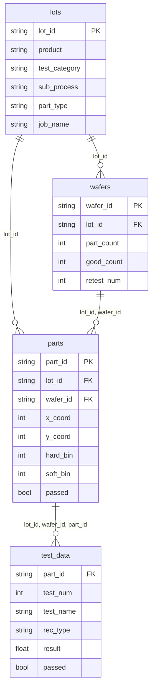

# stdf2pq テーブルスキーマ

STDFファイルをParquet形式に変換した際のテーブル定義。  
DuckDBビュー経由でSQLクエリ可能。

---

## パーティション構造

```
data/
└── {table}/
    └── product={product}/
        └── test_category={CP|FT}/
            └── sub_process={CP1|FT2|...}/
                └── lot_id={lot_id}/
                    └── (wafer_id={id}/retest={n}/)  ← wafers のみ
                        └── data.parquet
```

---

## lots

ロット単位のメタデータ。1 STDF ファイル = 1 レコード。

| 列名 | 型 | ソース | 説明 |
|------|----|--------|------|
| lot_id | STRING | MIR.LOT_ID | ロットID |
| product | STRING | CLI / パス | 製品名 |
| test_category | STRING | sub_process から導出 | `CP` / `FT` / `OTHER` |
| sub_process | STRING | MIR.TEST_COD | 小工程（CP1, FT2 等） |
| part_type | STRING | MIR.PART_TYP | 品種名 |
| job_name | STRING | MIR.JOB_NAM | テストプログラム名 |
| job_rev | STRING | MIR.JOB_REV | テストプログラムリビジョン |
| start_time | TIMESTAMP(ms, UTC) | MIR.START_T | テスト開始時刻 |
| finish_time | TIMESTAMP(ms, UTC) | MRR.FINISH_T | テスト終了時刻 |
| tester_type | STRING | MIR.TSTR_TYP | テスター種別 |
| operator | STRING | MIR.OPER_NAM | オペレータ名 |

---

## wafers

ウェーハ単位のサマリ。リテスト履歴を保持。

| 列名 | 型 | ソース | 説明 |
|------|----|--------|------|
| wafer_id | STRING | WIR.WAFER_ID | ウェーハID |
| lot_id | STRING | MIR.LOT_ID | ロットID |
| head_num | INT64 | WIR.HEAD_NUM | ヘッド番号 |
| start_time | TIMESTAMP(ms, UTC) | WIR.START_T | テスト開始時刻 |
| finish_time | TIMESTAMP(ms, UTC) | WRR.FINISH_T | テスト終了時刻 |
| part_count | INT64 | WRR.PART_CNT | 総ダイ数 |
| good_count | INT64 | WRR.GOOD_CNT | 良品数 |
| rtst_count | INT64 | WRR.RTST_CNT | リテスト数 |
| abrt_count | INT64 | WRR.ABRT_CNT | アボート数 |
| test_rev | STRING | ファイル名 (Rev04等) | テストプログラムリビジョン |
| retest_num | INT64 | 自動算出 | リテスト番号（0=初回, 1,2...=リテスト） |
| source_file | STRING | CLI | 元STDFファイル名 |

> **リテスト**: 同一 lot_id + wafer_id で再 ingest すると `retest_num` がインクリメント。  
> 分析クエリでは最新 `retest_num` のみを使用（`ROW_NUMBER() OVER(PARTITION BY lot_id, wafer_id ORDER BY retest_num DESC)`）。

---

## parts

ダイ（チップ）単位の結果。

| 列名 | 型 | ソース | 説明 |
|------|----|--------|------|
| part_id | STRING | 自動生成 | `{wafer_id}_{連番}` |
| lot_id | STRING | MIR.LOT_ID | ロットID |
| wafer_id | STRING | WIR.WAFER_ID | ウェーハID |
| head_num | INT64 | PIR.HEAD_NUM | ヘッド番号 |
| site_num | INT64 | PIR.SITE_NUM | サイト番号 |
| x_coord | INT64 | PRR.X_COORD | X座標 |
| y_coord | INT64 | PRR.Y_COORD | Y座標 |
| hard_bin | INT64 | PRR.HARD_BIN | ハードビン |
| soft_bin | INT64 | PRR.SOFT_BIN | ソフトビン |
| passed | BOOL | PRR.PART_FLG | 合否 |
| test_count | INT64 | PRR.NUM_TEST | テスト実行数 |
| test_time | INT64 | PRR.TEST_T | テスト時間 (ms) |

---

## test_data

テスト項目ごとの測定結果（PTR / MPR / FTR を統合）。

| 列名 | 型 | ソース | 説明 |
|------|----|--------|------|
| lot_id | STRING | MIR.LOT_ID | ロットID |
| wafer_id | STRING | WIR.WAFER_ID | ウェーハID |
| part_id | STRING | 自動生成 | ダイID |
| x_coord | INT64 | PRR.X_COORD | X座標 |
| y_coord | INT64 | PRR.Y_COORD | Y座標 |
| test_num | INT64 | PTR/MPR/FTR.TEST_NUM | テスト番号 |
| test_name | STRING | PTR/MPR/FTR.TEST_TXT | テスト名 |
| rec_type | STRING | レコード種別 | `PTR` / `MPR` / `FTR` |
| lo_limit | FLOAT64 | PTR/MPR.LO_LIMIT | 下限規格値 |
| hi_limit | FLOAT64 | PTR/MPR.HI_LIMIT | 上限規格値 |
| units | STRING | PTR/MPR.UNITS | 単位 |
| result | FLOAT64 | PTR/MPR.RESULT | 測定値 |
| passed | BOOL | PTR/MPR/FTR.TEST_FLG | 合否 |

---

## ER図


