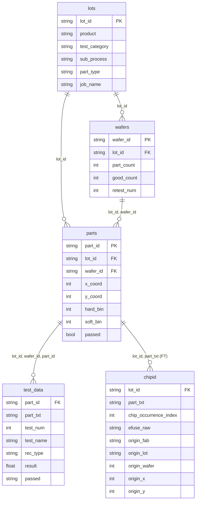

# stdf テーブルスキーマ

STDFファイルをParquet形式に変換した際のテーブル定義。  
DuckDBビュー経由でSQLクエリ可能。

---

## パーティション構造

```
data/
└── {table}/
    └── product={product}/
        └── test_category={CP|FT}/
            └── sub_process={CP1|FT2|...}/
                └── lot_id={lot_id}/
                    └── (wafer_id={id}/retest={n}/)  ← wafers / parts / test_data / chipid
                        └── data.parquet
```

> `lots` は `lot_id` まで。`wafers` / `parts` / `test_data` / `chipid` は
> さらに `wafer_id` / `retest` まで切る（FT はウェーハ概念が無いため
> `wafer_id=`（空）になる）。`product` / `test_category` / `sub_process` /
> `lot_id` / `wafer_id` / `retest` は Hive パーティション列として SELECT 可能。

---

## 適用範囲（CP / FT）

テーブルは工程によって生成有無・意味が変わります。**特に `wafers` は CP 専用**です。

| テーブル | CP | FT | 単位 / 備考 |
|---------|:--:|:--:|------|
| `lots` | ✓ | ✓ | 1 STDF = 1 行。MIR メタデータ |
| `wafers` | ✓ | **✗** | **CP 専用**。FT は WIR/WRR が無いため **1 行も生成されない** |
| `parts` | ✓ | ✓ | CP = ダイ / FT = パッケージ（1 PRR）。真の単位 |
| `test_data` | ✓ | ✓ | パラメトリック測定（PTR/MPR/FTR） |
| `chipid` | ✗ | ✓ | **FT 専用**。die 出自トレース（CP は出自＝プローブ座標で冗長） |

> **歩留りの算出元**: `wafers.part_count` / `good_count` は WRR の**報告値**で、
> リテスト実行時は再測定した部分母集団しか含まず、FT には存在しません。
> このため **歩留りは `parts_final`（ダイ/パッケージ単位・最新リテスト）から
> 算出**します（`analyze yield` / Web `/summary` / `/wafer-yield` も同様）。
> `wafers` は時刻・`rtst_count` 等の WRR メタ情報用と位置づけます。

---

## lots

ロット単位のメタデータ。1 STDF ファイル = 1 レコード。

| 列名 | 型 | ソース | 説明 |
|------|----|--------|------|
| lot_id | STRING | MIR.LOT_ID | ロットID |
| product | STRING | CLI / パス | 製品名 |
| test_category | STRING | sub_process から導出 | `CP` / `FT` / `OTHER` |
| sub_process | STRING | MIR.TEST_COD | 小工程（CP1, FT2 等） |
| part_type | STRING | MIR.PART_TYP | 品種名 |
| job_name | STRING | MIR.JOB_NAM | テストプログラム名 |
| job_rev | STRING | MIR.JOB_REV | テストプログラムリビジョン |
| start_time | TIMESTAMP(ms, UTC) | MIR.START_T | テスト開始時刻 |
| finish_time | TIMESTAMP(ms, UTC) | MRR.FINISH_T | テスト終了時刻 |
| tester_type | STRING | MIR.TSTR_TYP | テスター種別 |
| operator | STRING | MIR.OPER_NAM | オペレータ名 |

---

## wafers

ウェーハ単位のサマリ。リテスト履歴を保持。**CP 専用**（FT は WIR/WRR が無く生成
されない）。`part_count` / `good_count` は WRR の報告値のため、歩留りは
`parts_final` から算出する（[適用範囲](#適用範囲cp--ft) 参照）。

| 列名 | 型 | ソース | 説明 |
|------|----|--------|------|
| wafer_id | STRING | WIR.WAFER_ID | ウェーハID |
| lot_id | STRING | MIR.LOT_ID | ロットID |
| head_num | INT64 | WIR.HEAD_NUM | ヘッド番号 |
| start_time | TIMESTAMP(ms, UTC) | WIR.START_T | テスト開始時刻 |
| finish_time | TIMESTAMP(ms, UTC) | WRR.FINISH_T | テスト終了時刻 |
| part_count | INT64 | WRR.PART_CNT | 総ダイ数 |
| good_count | INT64 | WRR.GOOD_CNT | 良品数 |
| rtst_count | INT64 | WRR.RTST_CNT | リテスト数 |
| abrt_count | INT64 | WRR.ABRT_CNT | アボート数 |
| test_rev | STRING | ファイル名 (Rev04等) | テストプログラムリビジョン |
| retest_num | INT64 | 自動算出 | リテスト番号（0=初回, 1,2...=リテスト） |
| source_file | STRING | CLI | 元STDFファイル名 |

> **リテスト**: 同一 lot_id + wafer_id で再 ingest すると `retest_num` がインクリメント。  
> 分析クエリでは最新 `retest_num` のみを使用（`ROW_NUMBER() OVER(PARTITION BY lot_id, wafer_id ORDER BY retest_num DESC)`）。

---

## parts

ダイ（チップ）単位の結果。

| 列名 | 型 | ソース | 説明 |
|------|----|--------|------|
| part_id | STRING | 自動生成 | `{lot_id}_{wafer_id}_{連番}`（ストリーム順） |
| part_txt | STRING | PRR.PART_TXT | 2D バーコード（FT パッケージの一意キー。CP は通常空） |
| lot_id | STRING | MIR.LOT_ID | ロットID |
| wafer_id | STRING | WIR.WAFER_ID | ウェーハID（FT は空） |
| head_num | INT64 | PIR.HEAD_NUM | ヘッド番号 |
| site_num | INT64 | PIR.SITE_NUM | サイト番号 |
| x_coord | INT64 | PRR.X_COORD | X座標（FT は -32768） |
| y_coord | INT64 | PRR.Y_COORD | Y座標（FT は -32768） |
| hard_bin | INT64 | PRR.HARD_BIN | ハードビン |
| soft_bin | INT64 | PRR.SOFT_BIN | ソフトビン |
| passed | BOOL | PRR.PART_FLG | 合否 |
| test_count | INT64 | PRR.NUM_TEST | テスト実行数 |
| test_time | INT64 | PRR.TEST_T | テスト時間 (ms) |
| retest_num | INT64 | 自動算出 | リテスト番号（0=初回, 1,2...） |

---

## test_data

テスト項目ごとの測定結果（PTR / MPR / FTR を統合）。

| 列名 | 型 | ソース | 説明 |
|------|----|--------|------|
| lot_id | STRING | MIR.LOT_ID | ロットID |
| wafer_id | STRING | WIR.WAFER_ID | ウェーハID |
| part_id | STRING | 自動生成 | ダイID |
| part_txt | STRING | PRR.PART_TXT | 2D バーコード（FT パッケージキー。CP は通常空） |
| x_coord | INT64 | PRR.X_COORD | X座標 |
| y_coord | INT64 | PRR.Y_COORD | Y座標 |
| test_num | INT64 | PTR/MPR/FTR.TEST_NUM | テスト番号 |
| test_name | STRING | PTR/MPR/FTR.TEST_TXT | テスト名 |
| rec_type | STRING | レコード種別 | `PTR` / `MPR` / `FTR` |
| lo_limit | FLOAT64 | PTR/MPR.LO_LIMIT | 下限規格値 |
| hi_limit | FLOAT64 | PTR/MPR.HI_LIMIT | 上限規格値 |
| units | STRING | PTR/MPR.UNITS | 単位 |
| result | FLOAT64 | PTR/MPR.RESULT | 測定値 |
| passed | STRING | PTR/MPR/FTR.TEST_FLG | 合否（`P` / `F`） |
| retest_num | INT64 | 自動算出 | リテスト番号 |
| pin_num | INT64 | MPR.PMR_INDX | ピン番号（MPR のみ。PTR/FTR は NULL） |
| pin_name | STRING | PMR から解決 | ピン名（MPR のみ） |
| exec_seq | INT64 | 自動算出（ingest 時） | 同一 run 内でのキー出現順（0始まり）。ループ計測（例: OTP ダンプが 1 test_num に 512 PTR を書く）の各回を区別 |
| retest_flag | INT64 | 自動算出（ingest 時） | キーごとの新しさ順位。0 = そのキーを含む最新 run。`test_data_final` は `retest_flag = 0` で絞り込み |

---

## chipid

FT chiplet 製品の die トレーサビリティ。GDR の `EN-S0-CHIPID_R`（**digit zero**）
をデコードした eFuse の出自情報。**FT のみ生成**（CP は出自＝プローブ座標で冗長な
ため書き込まない）。1 パッケージ（1 PRR）が 2 die を含むため 1 部品あたり複数行。

| 列名 | 型 | ソース | 説明 |
|------|----|--------|------|
| lot_id | STRING | MIR.LOT_ID | FT ロットID |
| part_id | STRING | 自動生成 | 部品ID（ストリーム順） |
| part_txt | STRING | PRR.PART_TXT | 2D バーコード（パッケージの一意キー） |
| chip_occurrence_index | INT64 | 出現順 | DUT 内の die 区別（0, 1, ...） |
| efuse_raw | STRING | GDR 値 | 正規化済み 64bit 文字列（**die の恒久ID**） |
| valid | BOOL | デコード結果 | 64bit デコード成功なら true |
| origin_fab_code | INT64 | EFUSE[0:4] | fab コード |
| origin_fab | STRING | デコード | `TSMC1` / `TSMC2` / `UNSUPPORTED` |
| origin_lot | STRING | デコード | CP ロット（6 文字） |
| origin_wafer | INT64 | デコード | 出自ウェーハ番号 |
| origin_x | INT64 | デコード | 出自 X 座標 |
| origin_y | INT64 | デコード | 出自 Y 座標 |
| reserved_bits | STRING | EFUSE[62:64] | 予備ビット |
| retest_num | INT64 | 自動算出 | リテスト番号 |

> ビット配置: `EFUSE[0:4]`=fab, `[4:13]`=Y(9bit), `[13:22]`=X(9bit),
> `[22:27]`=wafer(5bit, 値-3), `[27:62]`=lot(CHAR1×1 + CHAR2×5), `[62:64]`=予備。

---

## 派生 VIEW（`*_final`）

リテストの最新のみを残す重複排除ビュー。dedup の単位（identity）は工程で分岐：

| VIEW | dedup 方式 | 用途 |
|------|------------|------|
| `parts_final` | `ROW_NUMBER() OVER (PARTITION BY lot_id, <dedup 単位> ORDER BY retest_num DESC)` | 最新リテストのダイ/パッケージ |
| `test_data_final` | `WHERE retest_flag = 0`（ingest 時に付与済み。下記参照） | 最新リテストの測定値（ループ計測は全行保持） |
| `chipid_final` | `ROW_NUMBER() OVER (PARTITION BY lot_id, efuse_raw ORDER BY retest_num DESC)` | die（eFuse）単位の最新。occurrence 順入替えに堅牢 |

`parts_final` / `chipid_final` は小テーブルなのでウィンドウ計算コストが無視できる範囲。
CP は従来どおりウェーハ座標、FT は座標が無いため 2D バーコード（`part_txt`）/ eFuse を
identity に使う。

`test_data_final` は `retest_num` 順のウィンドウではなく、ingest 時に `storage.py` が
書き込む `retest_flag`（キーごとの新しさ順位。0 = 最新 run）を使った単純な述語フィルタ。
ウィンドウの `PARTITION BY` は述語ではないため、非パーティション列（`test_name` など）
への絞り込みがウィンドウの下までプッシュダウンされず、ロット絞り込みの `test_name LIKE`
検索が実データで 12 分以上かかる原因になっていた。`retest_flag = 0` は通常の述語なので
Parquet スキャンまでプッシュダウンされ、高速。

また、旧ウィンドウ版は (die, test, pin) ごとに 1 行だけを残す仕様だったため、ループ計測
（例: OTP ダンプが 1 test_num の下に 512 個の PTR を書く場合）の 511/512 行が無条件に
捨てられ、Fail した回だけが消えることもあった。フラグ方式は最新 run の全行を保持する
ため、ループ回を区別するには `exec_seq`（run 内 0 始まり出現順）を使う。

`retest_flag IS NULL`（旧スキーマ／フラグ未対応でストアされたファイル）の行は
`test_data_final` から除外される — そのストアは再取り込みが必要。`stdf db verify-flags`
で検出できる。

---

## ER図


```mermaid
erDiagram
    lots ||--o{ wafers : "lot_id"
    lots ||--o{ parts : "lot_id"
    wafers ||--o{ parts : "lot_id, wafer_id"
    parts ||--o{ test_data : "lot_id, wafer_id, part_id"
    parts ||--o{ chipid : "lot_id, part_txt (FT)"

    lots {
        string lot_id PK
        string product
        string test_category
        string sub_process
        string part_type
        string job_name
    }
    wafers {
        string wafer_id PK
        string lot_id FK
        int part_count
        int good_count
        int retest_num
    }
    parts {
        string part_id PK
        string lot_id FK
        string wafer_id FK
        int x_coord
        int y_coord
        int hard_bin
        int soft_bin
        bool passed
    }
    test_data {
        string part_id FK
        string part_txt
        int test_num
        string test_name
        string rec_type
        float result
        string passed
    }
    chipid {
        string lot_id FK
        string part_txt
        int chip_occurrence_index
        string efuse_raw
        string origin_fab
        string origin_lot
        int origin_wafer
        int origin_x
        int origin_y
    }
```
